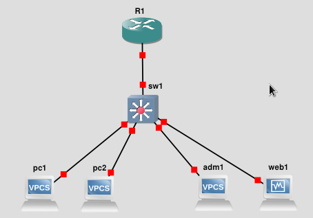
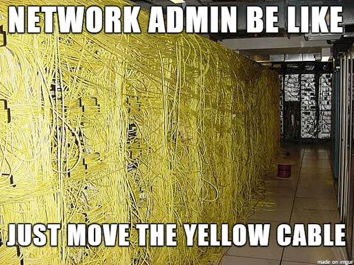
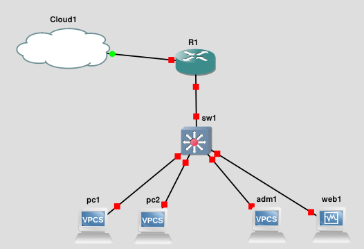
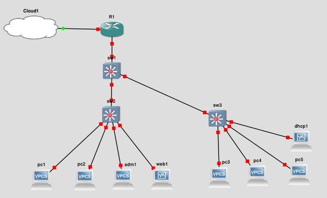
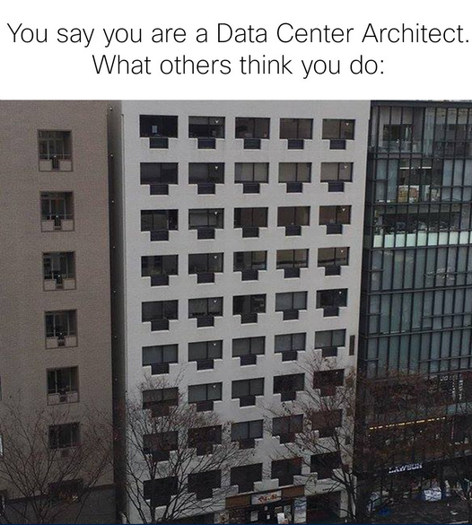

# TP4 : Router-on-a-stick

On va utiliser GNS3 dans ce TP pour se rapprocher d'un cas réel. La topologie qu vous mettez en place en fin de TP c'est tellement du classique qu'on lui a donné un nom : Router on a Stick.

Un seul routeur, plein de switches, plein de clients, plein de VLANs. Router on a Stick.

On va donc focus sur l'aspect routing/switching, avec du matériel Cisco. On va aussi mettre en place des VLANs, et du routage.


# Sommaire

- [TP4 : Router-on-a-stick](#tp4--router-on-a-stick)
- [Sommaire](#sommaire)
- [0. Prérequis](#0-prérequis)
  - [Checklist VM Linux](#checklist-vm-linux)
- [I. Topo 1 : VLAN et Routing](#i-topo-1--vlan-et-routing)
  - [1. Topologie 1](#1-topologie-1)
  - [2. Adressage topologie 1](#2-adressage-topologie-1)
  - [3. Setup topologie 1](#3-setup-topologie-1)
- [II. NAT](#ii-nat)
  - [1. Topologie 2](#1-topologie-2)
  - [2. Adressage topologie 2](#2-adressage-topologie-2)
  - [3. Setup topologie 2](#3-setup-topologie-2)
- [III. Add a building](#iii-add-a-building)
  - [1. Topologie 3](#1-topologie-3)
  - [2. Adressage topologie 3](#2-adressage-topologie-3)
  - [3. Setup topologie 3](#3-setup-topologie-3)

# 0. Prérequis

➜ Les clients seront soit :

- VMs Rocky Linux
- VPCS
  - c'est un truc de GNS pour simuler un client du réseau
  - quand on veut juste un truc capable de faire des pings et rien de plus, c'est parfait
  - ça consomme R en ressources

> Faites bien attention aux logos des machines sur les schémas, et vous verrez clairement quand il faut un VPCS ou une VM.

➜ Les switches Cisco des vIOL2 (IOU)

➜ Les routeurs Cisco des c3640

➜ **Vous ne créerez aucune machine virtuelle au début. Vous les créerez au fur et à mesure que le TP vous le demande.** A chaque fois qu'une nouvelle machine devra être créée, vous trouverez l'emoji 🖥️ avec son nom.

## Checklist VM Linux

A chaque machine déployée, vous **DEVREZ** vérifier la 📝**checklist**📝 :

- [x] IP locale, statique ou dynamique
- [x] hostname défini
- [x] firewall actif, qui ne laisse passer que le strict nécessaire
- [x] on force une host-only, juste pour pouvoir SSH
- [x] SSH fonctionnel
- [x] résolution de nom
  - vers internet, quand vous aurez le routeur en place

**Les éléments de la 📝checklist📝 sont STRICTEMENT OBLIGATOIRES à réaliser mais ne doivent PAS figurer dans le rendu.**

# I. Topo 1 : VLAN et Routing

Dans cette partie, on va donner un peu de sens aux VLANs :

- un pour les serveurs du réseau
  - on simulera ça avec un p'tit serveur web
- un pour les admins du réseau
- un pour les autres random clients du réseau

Cela dit, il faut que tout ce beau monde puisse se ping, au moins joindre le réseau des serveurs, pour accéder au super site-web.

**Bien que bloqué au niveau du switch à cause des VLANs, le trafic pourra passer d'un VLAN à l'autre grâce à un routeur.**

Il assurera son job de routeur traditionnel : router entre deux réseaux. Sauf qu'en plus, il gérera le changement de VLAN à la volée.

## 1. Topologie 1



## 2. Adressage topologie 1

Les réseaux et leurs VLANs associés :

| Réseau    | Adresse        | VLAN associé |
| --------- | -------------- | ------------ |
| `clients` | `10.1.10.0/24`  | 10           |
| `admins`  | `10.1.20.0/24` | 20           |
| `servers` | `10.1.30.0/24` | 30           |

L'adresse des machines au sein de ces réseaux :

| Node               | `clients`       | `admins`         | `servers`        |
| ------------------ | --------------- | ---------------- | ---------------- |
| `pc1.clients.tp4`  | `10.1.10.1/24`   | x                | x                |
| `pc2.clients.tp4`  | `10.1.10.2/24`   | x                | x                |
| `adm1.admins.tp4`  | x               | `10.1.20.1/24`   | x                |
| `web1.servers.tp4` | x               | x                | `10.1.30.1/24`   |
| `r1`               | `10.1.10.254/24` | `10.1.20.254/24` | `10.1.30.254/24` |

## 3. Setup topologie 1

🖥️ VM `web1.servers.tp4`, déroulez la [Checklist VM Linux](#checklist-vm-linux) dessus

🌞 **Adressage**

- définissez les IPs statiques sur toutes les machines **sauf le *routeur***

🌞 **Configuration des VLANs**

- référez-vous au [mémo Cisco](../../../../cours/memo/memo_cisco.md)
- déclaration des VLANs sur le switch `sw1`
- ajout des ports du switches dans le bon VLAN (voir [le tableau d'adressage de la topo 2 juste au dessus](#2-adressage-topologie-2))
- il faudra ajouter le port qui pointe vers le *routeur* comme un *trunk* : c'est un port entre deux équipements réseau (un *switch* et un *routeur*)

---

➜ **Pour le *routeur***

- référez-vous au [mémo Cisco](../../../../cours/memo/memo_cisco.md)
- ici, on va avoir besoin d'un truc très courant pour un *routeur* : qu'il porte plusieurs IP sur une unique interface
  - avec Cisco, on crée des "sous-interfaces" sur une interface
  - et on attribue une IP à chacune de ces sous-interfaces
- en plus de ça, il faudra l'informer que, pour chaque interface, elle doit être dans un VLAN spécifique

Pour ce faire, un exemple. On attribue deux IPs `192.168.1.254/24` VLAN 10 et `192.168.2.254` VLAN20 à un *routeur*. L'interface concernée sur le *routeur* est `fastEthernet 0/0` :

```cisco
# conf t

(config)# interface fastEthernet 0/0.10
R1(config-subif)# encapsulation dot1Q 10
R1(config-subif)# ip addr 192.168.1.254 255.255.255.0 
R1(config-subif)# exit

(config)# interface fastEthernet 0/0.20
R1(config-subif)# encapsulation dot1Q 20
R1(config-subif)# ip addr 192.168.2.254 255.255.255.0 
R1(config-subif)# exit
```

🌞 **Config du *routeur***

- attribuez ses IPs au *routeur*
  - 3 sous-interfaces, chacune avec son IP et un VLAN associé

🌞 **Vérif**

- tout le monde doit pouvoir ping le routeur sur l'IP qui est dans son réseau
- en ajoutant une route vers les réseaux, ils peuvent se ping entre eux
  - ajoutez une route par défaut sur les VPCS
  - ajoutez une route par défaut sur la machine virtuelle
  - testez des `ping` entre les réseaux


# II. NAT

On va ajouter une fonctionnalité au routeur : le NAT.

On va le connecter à internet (simulation du fait d'avoir une IP publique) et il va faire du NAT pour permettre à toutes les machines du réseau d'avoir un accès internet.



## 1. Topologie 2



## 2. Adressage topologie 2

Les réseaux et leurs VLANs associés :

| Réseau    | Adresse        | VLAN associé |
| --------- | -------------- | ------------ |
| `clients` | `10.1.10.0/24` | 10           |
| `admins`  | `10.1.20.0/24` | 20           |
| `servers` | `10.1.30.0/24` | 30           |

L'adresse des machines au sein de ces réseaux :

| Node               | `clients`       | `admins`         | `servers`        |
| ------------------ | --------------- | ---------------- | ---------------- |
| `pc1.clients.tp4`  | `10.1.1.1/24`   | x                | x                |
| `pc2.clients.tp4`  | `10.1.1.2/24`   | x                | x                |
| `adm1.admins.tp4`  | x               | `10.1.20.1/24`   | x                |
| `web1.servers.tp4` | x               | x                | `10.1.30.1/24`   |
| `r1`               | `10.1.1.254/24` | `10.1.20.254/24` | `10.1.30.254/24` |

## 3. Setup topologie 2

🌞 **Ajoutez le noeud Cloud à la topo**

- branchez à `eth1` côté Cloud
- côté routeur, il faudra récupérer un IP en DHCP (voir [le mémo Cisco](../../../../cours/memo/memo_cisco.md))
- vous devriez pouvoir `ping 1.1.1.1`

🌞 **Configurez le NAT**

- référez-vous [à la section NAT du mémo Cisco](../../../../cours/memo/memo_cisco.md)

🌞 **Test**

- ajoutez une route par défaut (si c'est pas déjà fait)
  - sur les VPCS
  - sur la machine Linux
- configurez l'utilisation d'un DNS
  - sur les VPCS
  - sur la machine Linux
- vérifiez un `ping` vers un nom de domaine

# III. Add a building

On a acheté un nouveau bâtiment, faut tirer et configurer un nouveau switch jusque là-bas.

On va en profiter pour setup un serveur DHCP pour les clients qui s'y trouvent.

## 1. Topologie 3



## 2. Adressage topologie 3

Les réseaux et leurs VLANs associés :

| Réseau    | Adresse        | VLAN associé |
| --------- | -------------- | ------------ |
| `clients` | `10.1.10.0/24`  | 10           |
| `admins`  | `10.1.20.0/24` | 20           |
| `servers` | `10.1.30.0/24` | 30           |

L'adresse des machines au sein de ces réseaux :

| Node                | `clients`       | `admins`         | `servers`        |
| ------------------- | --------------- | ---------------- | ---------------- |
| `pc1.clients.tp4`   | `10.1.10.1/24`   | x                | x                |
| `pc2.clients.tp4`   | `10.1.10.2/24`   | x                | x                |
| `pc3.clients.tp4`   | DHCP            | x                | x                |
| `pc4.clients.tp4`   | DHCP            | x                | x                |
| `pc5.clients.tp4`   | DHCP            | x                | x                |
| `dhcp1.clients.tp4` | `10.1.10.253/24` | x                | x                |
| `adm1.admins.tp4`   | x               | `10.1.20.1/24`   | x                |
| `web1.servers.tp4`  | x               | x                | `10.1.30.1/24`   |
| `r1`                | `10.1.10.254/24` | `10.1.20.254/24` | `10.1.30.254/24` |

## 3. Setup topologie 3

Vous pouvez partir de la topologie 2.

🌞  **Vous devez me rendre le `show running-config` de tous les équipements**

- de tous les équipements réseau
  - le routeur
  - les 3 switches

> N'oubliez pas les VLANs sur tous les switches.

🖥️ **VM `dhcp1.client1.tp4`**, déroulez la [Checklist VM Linux](#checklist-vm-linux) dessus

🌞  **Mettre en place un serveur DHCP dans le nouveau bâtiment**

- il doit distribuer des IPs aux clients dans le réseau `clients` qui sont branchés au même switch que lui
- sans aucune action manuelle, les clients doivent...
  - avoir une IP dans le réseau `clients`
  - avoir un accès au réseau `servers`
  - avoir un accès WAN
  - avoir de la résolution DNS

> Réutiliser un serveur DHCP qu'on a monté dans un autre TP si vous avez.

🌞  **Vérification**

- un client récupère une IP en DHCP
- il peut ping le serveur Web
- il peut ping `1.1.1.1`
- il peut ping `ynov.com`

> Faites ça sur n'importe quel VPCS que vous venez d'ajouter : `pc3` ou `pc4` ou `pc5`.



