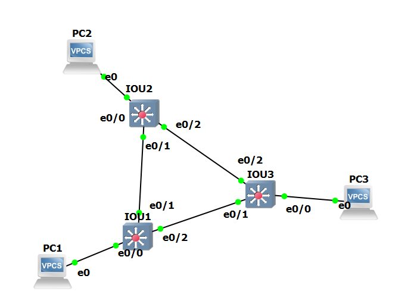
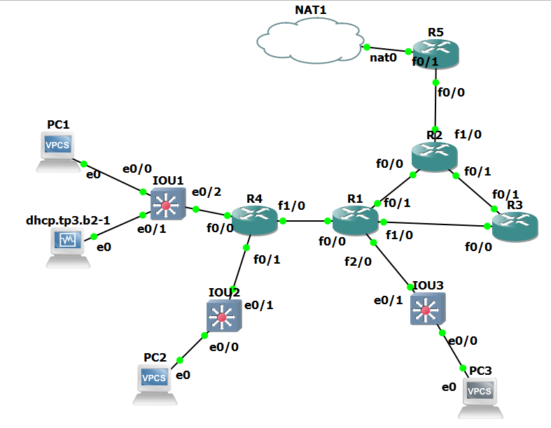

# TP6 : STP, OSPF, bigger infra

TP où on avance sur des protocoles toujours très utilisés, mais qu'on va trouver surtout dans des gros réseaux.

On considère que ça reste des bases en admin réseau. Au menu donc :

- expérimenter STP
  - ptite topo simple avec plusieurs switches
- expérimenter OSPF
  - routage dynamique : les routeurs se partagent leurs routes
  - topo un peu plus fat
  - on en profite pour voir du DHCP Relay

> *Dans ce TP, pas de VLANs pour simplifier, et focus sur le sujet. Dans la vie réelle, les VLANs sont omniprésents.*

## Sommaire

- [TP6 : STP, OSPF, bigger infra](#tp6--stp-ospf-bigger-infra)
  - [Sommaire](#sommaire)
  - [0. Setup](#0-setup)
  - [I. STP](#i-stp)
  - [II. OSPF](#ii-ospf)
  - [III. DHCP relay](#iii-dhcp-relay)
  - [IV. Bonus](#iv-bonus)
    - [1. ACL](#1-acl)

## 0. Setup

➜ **Faites chauffer GNS**

- VM Rocky prête à être clonée
- du switch et routeur Cisco, on reste sur les images des précédents TPs

Hop petit hint en passant, on peut configurer le hostname des routeurs Cisco avec :

```cisco
R1# conf t
R1(config)# hostname meow
meow(config)# incroyable
```

➜ **Augmentez la RAM des routeurs** dans GNS, surtout celui qui est connecté à internet (partie II.) à 256M

## I. STP

On va setup STP, au sein d'une topo simple pour que vous le voyiez en action.



🌞 **Configurer STP sur les 3 switches**

- bon c'est surtout activé par défaut en 2023
- je veux bien un `show spanning-tree`
  - y'a forcément un port en état *BLK* là

```
IOU1#show spanning-tree | include Interface |Et0/0|Et0/1|Et0/2
Interface           Role Sts Cost      Prio.Nbr Type
Et0/0               Desg FWD 100       128.1    P2p
Et0/1               Desg FWD 100       128.2    P2p
Et0/2               Desg FWD 100       128.3    P2p

IOU2#show spanning-tree | include Interface |Et0/0|Et0/1|Et0/2
Interface           Role Sts Cost      Prio.Nbr Type
Et0/0               Desg FWD 100       128.1    P2p
Et0/1               Root FWD 100       128.2    P2p
Et0/2               Desg FWD 100       128.3    P2p

IOU3#show spanning-tree | include Interface |Et0/0|Et0/1|Et0/2
Interface           Role Sts Cost      Prio.Nbr Type
Et0/0               Desg FWD 100       128.1    P2p
Et0/1               Root FWD 100       128.2    P2p
Et0/2               Altn BLK 100       128.3    P2p
```

🌞 **Altérer le spanning-tree** en désactivant un port

- désactiver juste un port de un switch pour provoquer la mise à jour de STP
- `show spanning-tree` pour voir la diff

> Référez-vous [au mémo Cisco](../../../cours/memo/cisco.md) pour les commandes STP.

```
IOU1(config)#interface ethernet0/1 (switch 1 vers le switch 2)
IOU1(config-if)#shutdown

IOU1#show spanning-tree | include Interface |Et0/0|Et0/1|Et0/2
Interface           Role Sts Cost      Prio.Nbr Type
Et0/0               Desg FWD 100       128.1    P2p
Et0/2               Desg FWD 100       128.3    P2p

IOU3#show spanning-tree

Interface           Role Sts Cost      Prio.Nbr Type
------------------- ---- --- --------- -------- --------------------------------
Et0/0               Desg FWD 100       128.1    P2p
Et0/1               Root FWD 100       128.2    P2p
Et0/2               Desg LIS 100       128.3    P2p (swith 3 vers switch 2)
```

🌞 **Altérer le spanning-tree** en modifiant le coût d'un lien

- modifier le coût d'un lien existant pour modifier l'arbre spanning-tree

```
IOU3#show spanning-tree | include Et0/2
Et0/2               Root FWD 100        16.3    P2p
```

🦈 **`tp6_stp.pcapng`**

- capturez du trafic STP, quelques trames
- interprétez les trames (rien dans le rendu à écrire, mais juste, fais l'effort de capter ce que les switches échangent comme message)

[Trames trafic STP](/B2_2023/Infra_Tp6/wireshark/tp6_stp.pcapng)

## II. OSPF

OSPF donc, routage dynamique.

On va se cantonner à le setup de façon simple, et ensuite on mettra en place un service qui consomme ce routage en partie III.



> Ce sont les *areas* OSPF qui sont représentées en couleur, pas des réseaux. 🌸

➜ Tableau d'adressage

- la logique de l'adressage que je vous propose :
  - choix de masque
    - du `/24` pour les réseaux où y'a des clients
      - classique, simple
    - du `/30` pour les réseaux entre les routeurs
      - comme ça, on permet vraiment explicitement que deux IPs sur ces réseaux
  - choix des octets
    - `10.6.` pour les deux premiers octets
      - 10 pas chiant comme d'hab
      - 6 pour TP6 comme d'hab
    - pour le troisième octet
      - entre les routeurs : `10.6.13.` l'octet qui suit :
        - 13 indique le réseau entre le routeur 1 et le routeur 3
        - 13 et pas 31 parce que je lis de gauche à droite perso
      - réseaux clients : `10.6.1.`
        - arbitraire, y'a un réseau 1, un réseau 2, etc.

| Node          | `10.6.1.0/24` | `10.6.2.0/24` | `10.6.3.0/24` | `10.6.41.0/30` | `10.6.13.0/30` | `10.6.21.0/30` | `10.6.23.0/30` | `10.6.52.0/30` |
| ------------- | ------------- | ------------- | ------------- | -------------- | -------------- | -------------- | -------------- | -------------- |
| `waf.tp6.b1`  | `10.6.1.11`   | ❌            | ❌            | ❌             | ❌             | ❌             | ❌             | ❌             |
| `dhcp.tp6.b1` | `10.6.1.253`  | ❌            | ❌            | ❌             | ❌             | ❌             | ❌             | ❌             |
| `meo.tp6.b1`  | ❌            | `10.6.2.11`   | ❌            | ❌             | ❌             | ❌             | ❌             | ❌             |
| `john.tp6.b1` | ❌            | ❌            | `10.6.3.11`   | ❌             | ❌             | ❌             | ❌             | ❌             |
| `R1`          | ❌            | ❌            | `10.6.3.254`  | `10.6.41.1`    | `10.6.13.1`    | `10.6.21.1`    | ❌             | ❌             |
| `R2`          | ❌            | ❌            | ❌            | ❌             | ❌             | `10.6.21.2`    | `10.6.23.2`    | `10.6.52.2`    |
| `R3`          | ❌            | ❌            | ❌            | ❌             | `10.6.13.2`    | ❌             | `10.6.23.1`    | ❌             |
| `R4`          | `10.6.1.254`  | `10.6.2.254`  | ❌            | `10.6.41.2`    | ❌             | ❌             | ❌             | ❌             |
| `R5`          | ❌            | ❌            | ❌            | ❌             | ❌             | ❌             | ❌             | `10.6.52.1`    |

🌞 **Montez la topologie**

- IP statiques sur tout le monde
  - assurez-vous que les pings passent au sein de chacun des LANs
  - au fur et à mesure que vous configurez

```
R5#ping 10.6.52.2

Type escape sequence to abort.
Sending 5, 100-byte ICMP Echos to 10.6.52.2, timeout is 2 seconds:
!!!!!
Success rate is 100 percent (5/5), round-trip min/avg/max = 8/18/24 ms
R5#ping 1.1.1.1

Type escape sequence to abort.
Sending 5, 100-byte ICMP Echos to 1.1.1.1, timeout is 2 seconds:
!!!!!
Success rate is 100 percent (5/5), round-trip min/avg/max = 20/30/44 ms
R5#show ip int br
Interface                  IP-Address      OK? Method Status                Protocol
FastEthernet0/0            10.6.52.1       YES manual up                    up
FastEthernet0/1            192.168.94.133  YES DHCP   up                    up
FastEthernet1/0            unassigned      YES unset  administratively down down
FastEthernet2/0            unassigned      YES unset  administratively down down
NVI0                       10.6.52.1       YES unset  up                    up

-----------------------------------------------------------------

R2#show ip int br
Interface                  IP-Address      OK? Method Status                Protocol
FastEthernet0/0            10.6.21.2       YES manual up                    up
FastEthernet0/1            10.6.23.2       YES manual up                    up
FastEthernet1/0            10.6.52.2       YES manual up                    up
FastEthernet2/0            unassigned      YES unset  administratively down down
R2#
R2#ping 10.6.52.1

Type escape sequence to abort.
Sending 5, 100-byte ICMP Echos to 10.6.52.1, timeout is 2 seconds:
!!!!!
Success rate is 100 percent (5/5), round-trip min/avg/max = 8/12/24 ms
R2#ping 10.6.21.1

Type escape sequence to abort.
Sending 5, 100-byte ICMP Echos to 10.6.21.1, timeout is 2 seconds:
!!!!!
Success rate is 100 percent (5/5), round-trip min/avg/max = 16/19/20 ms
R2#ping 10.6.23.1

Type escape sequence to abort.
Sending 5, 100-byte ICMP Echos to 10.6.23.1, timeout is 2 seconds:
!!!!!
Success rate is 100 percent (5/5), round-trip min/avg/max = 8/10/16 ms

-------------------------------------------------------

R3#ping 10.6.23.2

Type escape sequence to abort.
Sending 5, 100-byte ICMP Echos to 10.6.23.2, timeout is 2 seconds:
!!!!!
Success rate is 100 percent (5/5), round-trip min/avg/max = 12/19/28 ms
R3#ping 10.6.13.1

Type escape sequence to abort.
Sending 5, 100-byte ICMP Echos to 10.6.13.1, timeout is 2 seconds:
!!!!!
Success rate is 100 percent (5/5), round-trip min/avg/max = 16/20/24 ms
R3#show ip int br
Interface                  IP-Address      OK? Method Status                Protocol
FastEthernet0/0            10.6.13.2       YES manual up                    up
FastEthernet0/1            10.6.23.1       YES manual up                    up
FastEthernet1/0            unassigned      YES unset  administratively down down
FastEthernet2/0            unassigned      YES unset  administratively down down

---------------------------------------------------------------

R1#show ip int br
Interface                  IP-Address      OK? Method Status                Protocol
FastEthernet0/0            10.6.41.1       YES manual up                    up
FastEthernet0/1            10.6.21.1       YES manual up                    up
FastEthernet1/0            10.6.13.1       YES manual up                    up
FastEthernet2/0            10.6.3.254      YES manual up                    up
R1#ping 10.6.13.2

Type escape sequence to abort.
Sending 5, 100-byte ICMP Echos to 10.6.13.2, timeout is 2 seconds:
.!!!!
Success rate is 80 percent (4/5), round-trip min/avg/max = 8/14/24 ms
R1#ping 10.6.21.2

Type escape sequence to abort.
Sending 5, 100-byte ICMP Echos to 10.6.21.2, timeout is 2 seconds:
.!!!!
Success rate is 80 percent (4/5), round-trip min/avg/max = 8/18/28 ms
R1#ping 10.6.3.11

Type escape sequence to abort.
Sending 5, 100-byte ICMP Echos to 10.6.3.11, timeout is 2 seconds:
!!!!!
Success rate is 100 percent (5/5), round-trip min/avg/max = 4/11/16 ms
R1#ping 10.6.41.2

Type escape sequence to abort.
Sending 5, 100-byte ICMP Echos to 10.6.41.2, timeout is 2 seconds:
!!!!!
Success rate is 100 percent (5/5), round-trip min/avg/max = 4/8/16 ms

--------------------------------------------------------------

R4#show ip int br
Interface                  IP-Address      OK? Method Status                Protocol
FastEthernet0/0            10.6.1.254      YES manual up                    up
FastEthernet0/1            10.6.2.254      YES manual up                    up
FastEthernet1/0            10.6.41.2       YES manual up                    up
FastEthernet2/0            unassigned      YES unset  administratively down down
R4#ping 10.6.41.1

Type escape sequence to abort.
Sending 5, 100-byte ICMP Echos to 10.6.41.1, timeout is 2 seconds:
.!!!!
Success rate is 80 percent (4/5), round-trip min/avg/max = 20/21/24 ms
R4# ping 10.6.23.2

Type escape sequence to abort.
Sending 5, 100-byte ICMP Echos to 10.6.23.2, timeout is 2 seconds:
.....
Success rate is 0 percent (0/5)
R4#ping 10.6.1.11

Type escape sequence to abort.
Sending 5, 100-byte ICMP Echos to 10.6.1.11, timeout is 2 seconds:
!!!!!
Success rate is 100 percent (5/5), round-trip min/avg/max = 1/10/20 ms
R4#ping 10.6.2.11

Type escape sequence to abort.
Sending 5, 100-byte ICMP Echos to 10.6.2.11, timeout is 2 seconds:
!!!!!
Success rate is 100 percent (5/5), round-trip min/avg/max = 4/9/20 ms

R4#ping 10.6.1.253

Type escape sequence to abort.
Sending 5, 100-byte ICMP Echos to 10.6.1.253, timeout is 2 seconds:
!!!!!
Success rate is 100 percent (5/5), round-trip min/avg/max = 4/13/36 ms


```

- configuration d'un NAT sur le routeur connecté à internet
- **aucune route statique ne doit être ajoutée nulle part**
- définissez aux clients (VPCS ou VMs) des IPs statiques et définissez leur gateway
  - ils auront toujours pas internet, car leur routeur n'a pas internet !

```
john.tp6.b1> show ip
NAME        : john.tp6.b1[1]
IP/MASK     : 10.6.3.11/24
GATEWAY     : 10.6.3.254

john.tp6.b1> ping 10.6.3.254
84 bytes from 10.6.3.254 icmp_seq=1 ttl=255 time=9.069 ms
84 bytes from 10.6.3.254 icmp_seq=2 ttl=255 time=5.597 ms

john.tp6.b1> ping 1.1.1.1
*10.6.3.254 icmp_seq=1 ttl=255 time=5.652 ms (ICMP type:3, code:1, Destination host unreachable)
*10.6.3.254 icmp_seq=2 ttl=255 time=2.507 ms (ICMP type:3, code:1, Destination host unreachable)

--------------------------------------------

waf.tp6.b1> show ip

NAME        : waf.tp6.b1[1]
IP/MASK     : 10.6.1.11/24
GATEWAY     : 10.6.1.254
DNS         :
MAC         : 00:50:79:66:68:00
LPORT       : 10005
RHOST:PORT  : 127.0.0.1:10006
MTU:        : 1500

waf.tp6.b1> ping 10.6.1.254
84 bytes from 10.6.1.254 icmp_seq=1 ttl=255 time=20.973 ms
84 bytes from 10.6.1.254 icmp_seq=2 ttl=255 time=5.437 ms

----------------------------------------------

meo.tp6.b1> show ip

NAME        : meo.tp6.b1[1]
IP/MASK     : 10.6.2.11/24
GATEWAY     : 10.6.2.254
DNS         :
MAC         : 00:50:79:66:68:01
LPORT       : 10007
RHOST:PORT  : 127.0.0.1:10008
MTU:        : 1500

meo.tp6.b1> ping 10.6.2.254
84 bytes from 10.6.2.254 icmp_seq=1 ttl=255 time=20.669 ms
84 bytes from 10.6.2.254 icmp_seq=2 ttl=255 time=7.946 ms
```

- aucune configuration particulière à faire sur `dhcp.tp6.b2` pour le moment, on fera ça en partie III.
  - juste une IP statique, pas de setup particulier

🌞 **Configurer OSPF sur tous les routeurs**

- tous les routeurs doivent partager tous les réseaux auxquels ils sont connectés
- un petit `show running-config` où vous enlevez ce que vous n'avez pas tapé pour le rendu !

```
R2#show run 
interface FastEthernet0/0
 ip address 10.6.21.2 255.255.255.252
 duplex auto
 speed auto
!
interface FastEthernet0/1
 ip address 10.6.23.2 255.255.255.252
 duplex auto
 speed auto
!
interface FastEthernet1/0
 ip address 10.6.52.2 255.255.255.252
 duplex auto
 speed auto
!
router ospf 1
 router-id 2.2.2.2
 log-adjacency-changes
 network 10.6.21.0 0.0.0.3 area 0
 network 10.6.23.0 0.0.0.3 area 0
 network 10.6.52.0 0.0.0.3 area 1
 
------------------------------

R5#show run
interface FastEthernet0/0
 ip address 10.6.52.1 255.255.255.252
 ip nat inside
 ip virtual-reassembly
 duplex auto
 speed auto
!
interface FastEthernet0/1
 ip address dhcp
 ip nat outside
 ip virtual-reassembly
 duplex auto
 speed auto
! 
router ospf 1
 router-id 5.5.5.5
 log-adjacency-changes
 network 10.6.52.0 0.0.0.3 area 1
 default-information originate always

------------------------------

R3#show run
interface FastEthernet0/0
 ip address 10.6.13.2 255.255.255.252
 duplex auto
 speed auto
!
interface FastEthernet0/1
 ip address 10.6.23.1 255.255.255.252
 duplex auto
 speed auto
!
router ospf 1
 router-id 3.3.3.3
 log-adjacency-changes
 network 10.6.13.0 0.0.0.3 area 0
 network 10.6.23.0 0.0.0.3 area 0

------------------------------

R4#show run
interface FastEthernet0/0
 ip address 10.6.1.254 255.255.255.0
 duplex auto
 speed auto
!
interface FastEthernet0/1
 ip address 10.6.2.254 255.255.255.0
 duplex auto
 speed auto
!
interface FastEthernet1/0
 ip address 10.6.41.2 255.255.255.252
 duplex auto
 speed auto
! 
router ospf 1
 router-id 4.4.4.4
 log-adjacency-changes
 network 10.6.1.0 0.0.0.255 area 3
 network 10.6.2.0 0.0.0.255 area 3
 network 10.6.41.0 0.0.0.3 area 3
 
------------------------------

R1#show run
interface FastEthernet0/0
 ip address 10.6.41.1 255.255.255.252
 duplex auto
 speed auto
!
interface FastEthernet0/1
 ip address 10.6.21.1 255.255.255.252
 duplex auto
 speed auto
!
interface FastEthernet1/0
 ip address 10.6.13.1 255.255.255.252
 duplex auto
 speed auto
!
interface FastEthernet2/0
 ip address 10.6.3.254 255.255.255.0
 duplex auto
 speed auto
!
router ospf 1
 router-id 1.1.1.1
 log-adjacency-changes
 network 10.6.3.0 0.0.0.3 area 2
 network 10.6.3.0 0.0.0.255 area 2
 network 10.6.13.0 0.0.0.3 area 0
 network 10.6.21.0 0.0.0.3 area 0
 network 10.6.41.0 0.0.0.3 area 3
```

- et un `show ip ospf neighbor` + `show ip route` sur chaque routeur
- n'oubliez pas de partager la route par défaut de R5 avec une commande OSPF spécifique

> Référez-vous [au mémo Cisco](../../../cours/memo/cisco.md) pour les commandes OSPF.

```
R2#show ip ospf neighbor

Neighbor ID     Pri   State           Dead Time   Address         Interface
3.3.3.3           1   FULL/DR         00:00:33    10.6.23.1       FastEthernet0/1
1.1.1.1           1   FULL/BDR        00:00:34    10.6.21.1       FastEthernet0/0
5.5.5.5           1   FULL/BDR        00:00:33    10.6.52.1       FastEthernet1/0

R2#show ip route
Gateway of last resort is 10.6.52.1 to network 0.0.0.0

     10.0.0.0/8 is variably subnetted, 8 subnets, 2 masks
O       10.6.13.0/30 [110/11] via 10.6.21.1, 00:35:54, FastEthernet0/0
O IA    10.6.1.0/24 [110/30] via 10.6.21.1, 00:35:54, FastEthernet0/0
O IA    10.6.2.0/24 [110/30] via 10.6.21.1, 00:35:54, FastEthernet0/0
O IA    10.6.3.0/24 [110/11] via 10.6.21.1, 00:35:54, FastEthernet0/0
C       10.6.21.0/30 is directly connected, FastEthernet0/0
C       10.6.23.0/30 is directly connected, FastEthernet0/1
O IA    10.6.41.0/30 [110/20] via 10.6.21.1, 00:35:55, FastEthernet0/0
C       10.6.52.0/30 is directly connected, FastEthernet1/0
O*E2 0.0.0.0/0 [110/1] via 10.6.52.1, 00:21:34, FastEthernet1/0

---------------------

R5#show ip route
Gateway of last resort is 192.168.94.2 to network 0.0.0.0

C    192.168.94.0/24 is directly connected, FastEthernet0/1
     10.0.0.0/8 is variably subnetted, 8 subnets, 2 masks
O IA    10.6.13.0/30 [110/21] via 10.6.52.2, 00:15:35, FastEthernet0/0
O IA    10.6.1.0/24 [110/40] via 10.6.52.2, 00:15:35, FastEthernet0/0
O IA    10.6.2.0/24 [110/40] via 10.6.52.2, 00:15:35, FastEthernet0/0
O IA    10.6.3.0/24 [110/21] via 10.6.52.2, 00:15:35, FastEthernet0/0
O IA    10.6.21.0/30 [110/20] via 10.6.52.2, 00:15:35, FastEthernet0/0
O IA    10.6.23.0/30 [110/20] via 10.6.52.2, 00:15:36, FastEthernet0/0
O IA    10.6.41.0/30 [110/30] via 10.6.52.2, 00:15:36, FastEthernet0/0
C       10.6.52.0/30 is directly connected, FastEthernet0/0
S*   0.0.0.0/0 [254/0] via 192.168.94.2

R5#show ip ospf neighbor

Neighbor ID     Pri   State           Dead Time   Address         Interface
2.2.2.2           1   FULL/DR         00:00:39    10.6.52.2       FastEthernet0/0

------------------------------

R4#show ip ospf neighbor

Neighbor ID     Pri   State           Dead Time   Address         Interface
1.1.1.1           1   FULL/BDR        00:00:36    10.6.41.1       FastEthernet1/0

R4#show ip route
Gateway of last resort is 10.6.41.1 to network 0.0.0.0

     10.0.0.0/8 is variably subnetted, 8 subnets, 2 masks
O IA    10.6.13.0/30 [110/2] via 10.6.41.1, 00:37:50, FastEthernet1/0
C       10.6.1.0/24 is directly connected, FastEthernet0/0
C       10.6.2.0/24 is directly connected, FastEthernet0/1
O IA    10.6.3.0/24 [110/2] via 10.6.41.1, 00:37:50, FastEthernet1/0
O IA    10.6.21.0/30 [110/11] via 10.6.41.1, 00:37:50, FastEthernet1/0
O IA    10.6.23.0/30 [110/12] via 10.6.41.1, 00:37:50, FastEthernet1/0
C       10.6.41.0/30 is directly connected, FastEthernet1/0
O IA    10.6.52.0/30 [110/12] via 10.6.41.1, 00:37:45, FastEthernet1/0
O*E2 0.0.0.0/0 [110/1] via 10.6.41.1, 00:23:19, FastEthernet1/0

------------------------------

R1#show ip ospf neighbor

Neighbor ID     Pri   State           Dead Time   Address         Interface
2.2.2.2           1   FULL/DR         00:00:30    10.6.21.2       FastEthernet0/1
3.3.3.3           1   FULL/DR         00:00:36    10.6.13.2       FastEthernet1/0
4.4.4.4           1   FULL/DR         00:00:34    10.6.41.2       FastEthernet0/0

R1#show ip route
Gateway of last resort is 10.6.21.2 to network 0.0.0.0

     10.0.0.0/8 is variably subnetted, 8 subnets, 2 masks
C       10.6.13.0/30 is directly connected, FastEthernet1/0
O       10.6.1.0/24 [110/20] via 10.6.41.2, 00:39:03, FastEthernet0/0
O       10.6.2.0/24 [110/20] via 10.6.41.2, 00:39:03, FastEthernet0/0
C       10.6.3.0/24 is directly connected, FastEthernet2/0
C       10.6.21.0/30 is directly connected, FastEthernet0/1
O       10.6.23.0/30 [110/11] via 10.6.13.2, 00:39:03, FastEthernet1/0
C       10.6.41.0/30 is directly connected, FastEthernet0/0
O IA    10.6.52.0/30 [110/11] via 10.6.21.2, 00:38:55, FastEthernet0/1
O*E2 0.0.0.0/0 [110/1] via 10.6.21.2, 00:24:28, FastEthernet0/1

------------------------------

R3#show ip ospf neighbor

Neighbor ID     Pri   State           Dead Time   Address         Interface
2.2.2.2           1   FULL/BDR        00:00:34    10.6.23.2       FastEthernet0/1
1.1.1.1           1   FULL/BDR        00:00:36    10.6.13.1       FastEthernet0/0

R3#show ip route
Gateway of last resort is 10.6.23.2 to network 0.0.0.0

     10.0.0.0/8 is variably subnetted, 8 subnets, 2 masks
C       10.6.13.0/30 is directly connected, FastEthernet0/0
O IA    10.6.1.0/24 [110/30] via 10.6.13.1, 00:39:31, FastEthernet0/0
O IA    10.6.2.0/24 [110/30] via 10.6.13.1, 00:39:31, FastEthernet0/0
O IA    10.6.3.0/24 [110/11] via 10.6.13.1, 00:39:31, FastEthernet0/0
O       10.6.21.0/30 [110/20] via 10.6.23.2, 00:39:31, FastEthernet0/1
                     [110/20] via 10.6.13.1, 00:39:21, FastEthernet0/0
C       10.6.23.0/30 is directly connected, FastEthernet0/1
O IA    10.6.41.0/30 [110/20] via 10.6.13.1, 00:39:32, FastEthernet0/0
O IA    10.6.52.0/30 [110/11] via 10.6.23.2, 00:39:32, FastEthernet0/1
O*E2 0.0.0.0/0 [110/1] via 10.6.23.2, 00:24:56, FastEthernet0/1
```

🌞 **Test**

- faites des `ping` dans tous les sens
- c'est simple hein : normalement tout le monde peut ping tout le monde
- et même tout le monde a internet y compris les clients
- mettez moi quelques `ping` dans le compte-rendu

```
waf.tp6.b1> ping 10.6.1.254
84 bytes from 10.6.1.254 icmp_seq=1 ttl=255 time=19.553 ms
84 bytes from 10.6.1.254 icmp_seq=2 ttl=255 time=10.322 ms
84 bytes from 10.6.1.254 icmp_seq=3 ttl=255 time=11.683 ms

waf.tp6.b1> ping 10.6.1.253
84 bytes from 10.6.1.253 icmp_seq=1 ttl=64 time=1.783 ms
84 bytes from 10.6.1.253 icmp_seq=2 ttl=64 time=2.346 ms
84 bytes from 10.6.1.253 icmp_seq=3 ttl=64 time=2.169 ms

waf.tp6.b1> ping 10.6.2.11
10.6.2.11 icmp_seq=1 timeout
10.6.2.11 icmp_seq=2 timeout
84 bytes from 10.6.2.11 icmp_seq=3 ttl=63 time=20.694 ms
84 bytes from 10.6.2.11 icmp_seq=4 ttl=63 time=56.949 ms

waf.tp6.b1> ping 10.6.3.11
10.6.3.11 icmp_seq=1 timeout
10.6.3.11 icmp_seq=2 timeout
84 bytes from 10.6.3.11 icmp_seq=3 ttl=62 time=39.256 ms
84 bytes from 10.6.3.11 icmp_seq=4 ttl=62 time=48.802 ms

waf.tp6.b1> ping 10.6.3.254
84 bytes from 10.6.3.254 icmp_seq=1 ttl=254 time=55.817 ms
84 bytes from 10.6.3.254 icmp_seq=2 ttl=254 time=29.448 ms

waf.tp6.b1> ping 10.6.41.1
84 bytes from 10.6.41.1 icmp_seq=1 ttl=254 time=24.274 ms
84 bytes from 10.6.41.1 icmp_seq=2 ttl=254 time=29.374 ms

waf.tp6.b1> ping 10.6.23.1
84 bytes from 10.6.23.1 icmp_seq=1 ttl=253 time=55.987 ms
84 bytes from 10.6.23.1 icmp_seq=2 ttl=253 time=49.602 ms
84 bytes from 10.6.23.1 icmp_seq=3 ttl=253 time=38.457 ms

waf.tp6.b1> ping 1.1.1.1
84 bytes from 1.1.1.1 icmp_seq=1 ttl=124 time=90.690 ms
84 bytes from 1.1.1.1 icmp_seq=2 ttl=124 time=103.346 ms
84 bytes from 1.1.1.1 icmp_seq=3 ttl=124 time=79.950 ms
84 bytes from 1.1.1.1 icmp_seq=4 ttl=124 time=91.247 ms
84 bytes from 1.1.1.1 icmp_seq=5 ttl=124 time=78.818 ms
```

🦈 **`tp6_ospf.pcapng`**

- capturez des BPDUs là où vous voulez
- interprétez les BPDUs

C'est le routeur 1 qui tient informé des routes qu'il a et  le routeur 2 dit "ouais, c'est moi cette route et moi, j'ai ça comme routes"

[tp6_ospf.pcapng](/B2_2023/Infra_Tp6/wireshark/tp6_ospf.pcapng)

> *Un BPDU c'est juste le nom qu'on donne à une trame OSPF échangée entre deux routeurs.*

## III. DHCP relay

➜ **Un problème très récurrent pour pas dire omniprésent avec DHCP c'est que ça marche que dans un LAN.**

Si t'as un serveur DHCP, et plein de réseaux comme c'est le cas ici, c'est le bordel :

- un DHCP Request, qui part en broadcast ne passe pas un routeur
- en effet, pour changer de réseau, il faut construire des paquets IP
- hors quand tu fais ton DHCP Request c'est ça que tu cherches : avoir une IP
- dans notre topo actuelle, impossible que John contacte le serveur DHCP

➜ **DHCP Relay !**

- on va demander à un routeur, s'il reçoit des trames DHCP de les faire passer vers notre serveur DHCP
- si le serveur DHCP le supporte, il répondra donc au routeur, qui fera passer au client

🌞 **Configurer un serveur DHCP** sur `dhcp.tp6.b1`

- même setup que d'habitude [(c'est ce lien que tu cherches ?)](https://www.server-world.info/en/note?os=Rocky_Linux_8&p=dhcp&f=1)
- votre serveur DHCP donne des IPs dans les réseaux
  - `10.6.1.0/24`
    - de `10.6.1.100` à `10.6.1.200`
    - informe les clients de l'adresse de la passerelle de ce réseau
    - informe les clients de l'adresse d'un serveur DNS : `1.1.1.1`
  - `10.6.3.0/24`
    - de `10.6.3.100` à `10.6.3.200`
    - informe les clients de l'adresse de la passerelle de ce réseau
    - informe les clients de l'adresse d'un serveur DNS : `1.1.1.1`
- pour le compte-rendu ça me suffit :
  - `sudo cat /etc/dhcp/dhcpd.conf`
  - `systemctl status dhcpd`

```
[joris@dhcptp6b2 ~]$ sudo cat /etc/dhcp/dhcpd.conf
#
# DHCP Server Configuration file.
#   see /usr/share/doc/dhcp-server/dhcpd.conf.example
#   see dhcpd.conf(5) man page
#
default-lease-time 900;
max-lease-time 10800;

authoritative;

subnet 10.6.1.0 netmask 255.255.255.0 {
range 10.6.1.100 10.6.1.200;
option routers 10.6.1.254;
option subnet-mask 255.255.255.0;
option domain-name-servers 1.1.1.1;
}

subnet 10.6.3.0 netmask 255.255.255.0 {
range 10.6.3.100 10.6.3.200;
option routers 10.6.3.254;
option subnet-mask 255.255.255.0;
option domain-name-servers 1.1.1.1;
}
```

🌞 **Configurer un DHCP relay sur la passerelle de John**

- vérifier que Waf et John peuvent récupérer une IP en DHCP

```
waf.tp6.b1> ip dhcp
DDORA IP 10.6.1.100/24 GW 10.6.1.254

john.tp6.b1> ip dhcp
DDORA IP 10.6.3.100/24 GW 10.6.3.254
```

- check les logs du serveur DHCP pour voir les DORA
  - je veux ces 4 lignes de logs dans le compte-rendu
  - pour John et pour Waf

```
[joris@dhcptp6b2]journalctl -xeu dhcpd.service
Dec 07 12:21:33 dhcptp6b2 dhcpd: DHCPDISCOVER from 00:58:79:66:68:00 (waf.tp6.b11) via enp0s3
Dec 07 12:21:33 dhcptp6b2 dhcpd: DHCPOFFER on 10.6.1.100 to 00:50:79:66:68:00 (waf.tp6.b11) via enp0s3
Dec 07 12:21:34 dhcptp6b2 dhcpd: DHCPREQUEST for 10.6.1.100 (10.6.1.253) from 00:50:79:66:68:00 (waf.tp6.b11) via enp0s3
Dec 07 12:21:34 dhcptp6b2 dhcpd: DHCPACK on 10.6.1.100 to 00:50:79:66:68:00 (waf.tp6.b11) via enp0s3
Dec 07 12:21:59 dhcptp6b2 dhcpd: reuse_lease: lease age 25 (secs) under 25% threshold, reply with unaltered, existing lease for 10.6.1.100
Dec 07 12:21:59 dhcptp6b2 dhcpd: DHCPDISCOVER from 00:58:79:66:68:00 (waf.tp6.b11) via enp0s3
Dec 07 12:21:59 dhcptp6b2 dhcpd: DHCPOFFER on 10.6.1.100 to 00:50:79:66:68:00 (waf.tp6.b11) via enp0s3
Dec 07 12:22:00 dhcptp6b2 dhcpd: reuse_lease: lease age 26 (secs) under 25% threshold, reply with unaltered, existing lease for 10.6.1.100
Dec 07 12:22:00 dhcptp6b2 dhcpd: DHCPREQUEST for 10.6.1.100 (10.6.1.253) from 00:58:79:66:68:00 (waf.tp6.b11) via enp0s3
Dec 07 12:22:00 dhcptp6b2 dhcpd: DHCPACK on 10.6.1.100 to 00:50:79:66:68:00 (waf.tp6.b11) via enp0s3
Dec 07 12:22:07 dhcptp6b2 dhcpd: DHCPDISCOVER from 00:50:79:66:68:02 (john.tp6.b11) via 10.6.3.254
Dec 07 12:22:07 dhcptp6b2 dhcpd: DHCPOFFER on 10.6.3.100 to 00:50:79:66:68:02 (john.tp6.b11) via 10.6.3.254
Dec 07 12:22:08 dhcptp6b2 dhcpd: DHCPREQUEST for 10.6.3.100 (10.6.1.253) from 00:50:79:66:68:02 (john.tp6.b11) via 10.6.3.254
Dec 07 12:22:08 dhcptp6b2 dhcpd: DHCPACK on 10.6.3.100 to 00:50:79:66:68:02 (john.tp6.b11) via 10.6.3.254
```

- la conf sur le routeur qui est la passerelle de John c'est :

```cisco
R1#conf t
R1(config)#interface fastEthernet 2/0 # interface qui va recevoir des requêtes DHCP
R1(config-if)#ip helper-address <DHCP_SERVER_IP_ADDRESS>
```

> *Ui c'est tout. Bah... quoi de plus ? Il a juste besoin de savoir à qui faire passer les requêtes !*

## IV. Bonus

### 1. ACL

C'est un peu moche que les clients puissent `ping` les IPs des routeurs de l'autre côté de l'infra.

Normalement, il peut joindre sa passerelle, internet, épuicétou.

🌞 **Configurer une access-list**

- ça se fait sur les routeurs
- le but :
  - les clients peuvent ping leur passerelle
  - et internet
  - épuicétou

