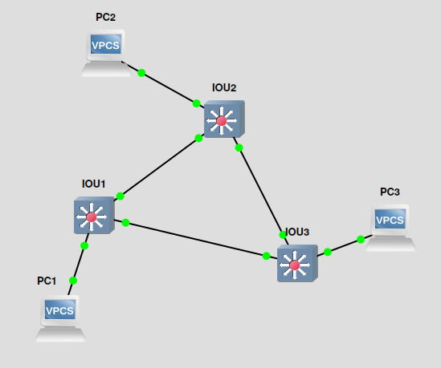
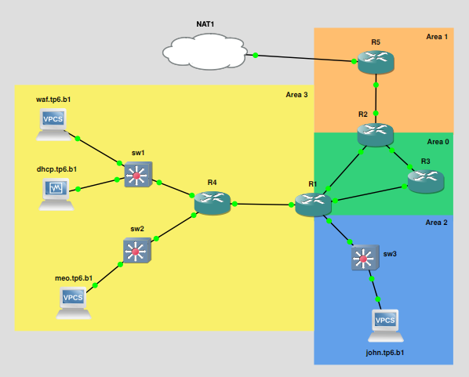

# TP6 : STP, OSPF, bigger infra

TP où on avance sur des protocoles toujours très utilisés, mais qu'on va trouver surtout dans des gros réseaux.

On considère que ça reste des bases en admin réseau. Au menu donc :

- expérimenter STP
  - ptite topo simple avec plusieurs switches
- expérimenter OSPF
  - routage dynamique : les routeurs se partagent leurs routes
  - topo un peu plus fat
  - on en profite pour voir du DHCP Relay

> *Dans ce TP, pas de VLANs pour simplifier, et focus sur le sujet. Dans la vie réelle, les VLANs sont omniprésents.*


## Sommaire

- [TP6 : STP, OSPF, bigger infra](#tp6--stp-ospf-bigger-infra)
  - [Sommaire](#sommaire)
  - [0. Setup](#0-setup)
  - [I. STP](#i-stp)
  - [II. OSPF](#ii-ospf)
  - [III. DHCP relay](#iii-dhcp-relay)
  - [IV. Bonus](#iv-bonus)
    - [1. ACL](#1-acl)

## 0. Setup

➜ **Faites chauffer GNS**

- VM Rocky prête à être clonée
- du switch et routeur Cisco, on reste sur les images des précédents TPs

Hop petit hint en passant, on peut configurer le hostname des routeurs Cisco avec :

```cisco
R1# conf t
R1(config)# hostname meow
meow(config)# incroyable
```

➜ **Augmentez la RAM des routeurs** dans GNS, surtout celui qui est connecté à internet (partie II.) à 256M

## I. STP

On va setup STP, au sein d'une topo simple pour que vous le voyiez en action.



🌞 **Configurer STP sur les 3 switches**

- bon c'est surtout activé par défaut en 2023
- je veux bien un `show spanning-tree`
  - y'a forcément un port en état *BLK* là

🌞 **Altérer le spanning-tree** en désactivant un port

- désactiver juste un port de un switch pour provoquer la mise à jour de STP
- `show spanning-tree` pour voir la diff

> Référez-vous [au mémo Cisco](../../../cours/memo/cisco.md) pour les commandes STP.

🌞 **Altérer le spanning-tree** en modifiant le coût d'un lien

- modifier le coût d'un lien existant pour modifier l'arbre spanning-tree

🦈 **`tp6_stp.pcapng`**

- capturez du trafic STP, quelques trames
- interprétez les trames (rien dans le rendu à écrire, mais juste, fais l'effort de capter ce que les switches échangent comme message)

## II. OSPF

OSPF donc, routage dynamique.

On va se cantonner à le setup de façon simple, et ensuite on mettra en place un service qui consomme ce routage en partie III.



> Ce sont les *areas* OSPF qui sont représentées en couleur, pas des réseaux. 🌸

➜ Tableau d'adressage

- la logique de l'adressage que je vous propose :
  - choix de masque
    - du `/24` pour les réseaux où y'a des clients
      - classique, simple
    - du `/30` pour les réseaux entre les routeurs
      - comme ça, on permet vraiment explicitement que deux IPs sur ces réseaux
  - choix des octets
    - `10.6.` pour les deux premiers octets
      - 10 pas chiant comme d'hab
      - 6 pour TP6 comme d'hab
    - pour le troisième octet
      - entre les routeurs : `10.6.13.` l'octet qui suit :
        - 13 indique le réseau entre le routeur 1 et le routeur 3
        - 13 et pas 31 parce que je lis de gauche à droite perso
      - réseaux clients : `10.6.1.`
        - arbitraire, y'a un réseau 1, un réseau 2, etc.

| Node          | `10.6.1.0/24` | `10.6.2.0/24` | `10.6.3.0/24` | `10.6.41.0/30` | `10.6.13.0/30` | `10.6.21.0/30` | `10.6.23.0/30` | `10.6.52.0/30` |
| ------------- | ------------- | ------------- | ------------- | -------------- | -------------- | -------------- | -------------- | -------------- |
| `waf.tp6.b1`  | `10.6.1.11`   | ❌            | ❌            | ❌             | ❌             | ❌             | ❌             | ❌             |
| `dhcp.tp6.b1` | `10.6.1.253`  | ❌            | ❌            | ❌             | ❌             | ❌             | ❌             | ❌             |
| `meo.tp6.b1`  | ❌            | `10.6.2.11`   | ❌            | ❌             | ❌             | ❌             | ❌             | ❌             |
| `john.tp6.b1` | ❌            | ❌            | `10.6.3.11`   | ❌             | ❌             | ❌             | ❌             | ❌             |
| `R1`          | ❌            | ❌            | `10.6.3.254`  | `10.6.41.1`    | `10.6.13.1`    | `10.6.21.1`    | ❌             | ❌             |
| `R2`          | ❌            | ❌            | ❌            | ❌             | ❌             | `10.6.21.2`    | `10.6.23.2`    | `10.6.52.2`    |
| `R3`          | ❌            | ❌            | ❌            | ❌             | `10.6.13.2`    | ❌             | `10.6.23.1`    | ❌             |
| `R4`          | `10.6.1.254`  | `10.6.2.254`  | ❌            | `10.6.41.2`    | ❌             | ❌             | ❌             | ❌             |
| `R5`          | ❌            | ❌            | ❌            | ❌             | ❌             | ❌             | ❌             | `10.6.52.1`    |

🌞 **Montez la topologie**

- IP statiques sur tout le monde
  - assurez-vous que les pings passent au sein de chacun des LANs
  - au fur et à mesure que vous configurez
- configuration d'un NAT sur le routeur connecté à internet
- **aucune route statique ne doit être ajoutée nulle part**
- définissez aux clients (VPCS ou VMs) des IPs statiques et définissez leur gateway
  - ils auront toujours pas internet, car leur routeur n'a pas internet !
- aucune configuration particulière à faire sur `dhcp.tp6.b2` pour le moment, on fera ça en partie III.
  - juste une IP statique, pas de setup particulier

➜ Bref...

- IP statiques partout
- clients avec une gateway définie
- et un NAT sur le routeur de bordure

On va pas ajouter toutes les routes sur tous les routeurs, ce serait une giga plaie à faire, à maintenir, et peu résilient.

OSPF donc.

🌞 **Configurer OSPF sur tous les routeurs**

- tous les routeurs doivent partager tous les réseaux auxquels ils sont connectés
- un petit `show running-config` où vous enlevez ce que vous n'avez pas tapé pour le rendu !
- et un `show ip ospf neighbor` + `show ip route` sur chaque routeur
- n'oubliez pas de partager la route par défaut de R5 avec une commande OSPF spécifique [voir mémo](../../../cours/memo/cisco.md)

> Référez-vous [au mémo Cisco](../../../cours/memo/cisco.md) pour les commandes OSPF.

🌞 **Test**

- faites des `ping` dans tous les sens
- c'est simple hein : normalement tout le monde peut ping tout le monde
- et même tout le monde a internet y compris les clients
- mettez moi quelques `ping` dans le compte-rendu

🦈 **`tp6_ospf.pcapng`**

- capturez des BPDUs là où vous voulez
- interprétez les BPDUs

> *Un BPDU c'est juste le nom qu'on donne à une trame OSPF échangée entre deux routeurs.*

## III. DHCP relay

➜ **Un problème très récurrent pour pas dire omniprésent avec DHCP c'est que ça marche que dans un LAN.**

Si t'as un serveur DHCP, et plein de réseaux comme c'est le cas ici, c'est le bordel :

- un DHCP Request, qui part en broadcast ne passe pas un routeur
- en effet, pour changer de réseau, il faut construire des paquets IP
- hors quand tu fais ton DHCP Request c'est ça que tu cherches : avoir une IP
- dans notre topo actuelle, impossible que John contacte le serveur DHCP

➜ **DHCP Relay !**

- on va demander à un routeur, s'il reçoit des trames DHCP de les faire passer vers notre serveur DHCP
- si le serveur DHCP le supporte, il répondra donc au routeur, qui fera passer au client

🌞 **Configurer un serveur DHCP** sur `dhcp.tp6.b1`

- même setup que d'habitude [(c'est ce lien que tu cherches ?)](https://www.server-world.info/en/note?os=Rocky_Linux_8&p=dhcp&f=1)
- votre serveur DHCP donne des IPs dans les réseaux
  - `10.6.1.0/24`
    - de `10.6.1.100` à `10.6.1.200`
    - informe les clients de l'adresse de la passerelle de ce réseau
    - informe les clients de l'adresse d'un serveur DNS : `1.1.1.1`
  - `10.6.3.0/24`
    - de `10.6.3.100` à `10.6.3.200`
    - informe les clients de l'adresse de la passerelle de ce réseau
    - informe les clients de l'adresse d'un serveur DNS : `1.1.1.1`
- pour le compte-rendu ça me suffit :
  - `sudo cat /etc/dhcp/dhcpd.conf`
  - `systemctl status dhcpd`

🌞 **Configurer un DHCP relay sur la passerelle de John**

- vérifier que Waf et John peuvent récupérer une IP en DHCP
- check les logs du serveur DHCP pour voir les DORA
  - je veux ces 4 lignes de logs dans le compte-rendu
  - pour John et pour Waf
- la conf sur le routeur qui est la passerelle de John c'est :

```cisco
R1#conf t
R1(config)#interface fastEthernet 2/0 # interface qui va recevoir des requêtes DHCP
R1(config-if)#ip helper-address <DHCP_SERVER_IP_ADDRESS>
```

> *Ui c'est tout. Bah... quoi de plus ? Il a juste besoin de savoir à qui faire passer les requêtes !*

## IV. Bonus

### 1. ACL

C'est un peu moche que les clients puissent `ping` les IPs des routeurs de l'autre côté de l'infra.

Normalement, il peut joindre sa passerelle, internet, épuicétou.

🌞 **Configurer une access-list**

- ça se fait sur les routeurs
- le but :
  - les clients peuvent ping leur passerelle
  - et internet
  - épuicétou
