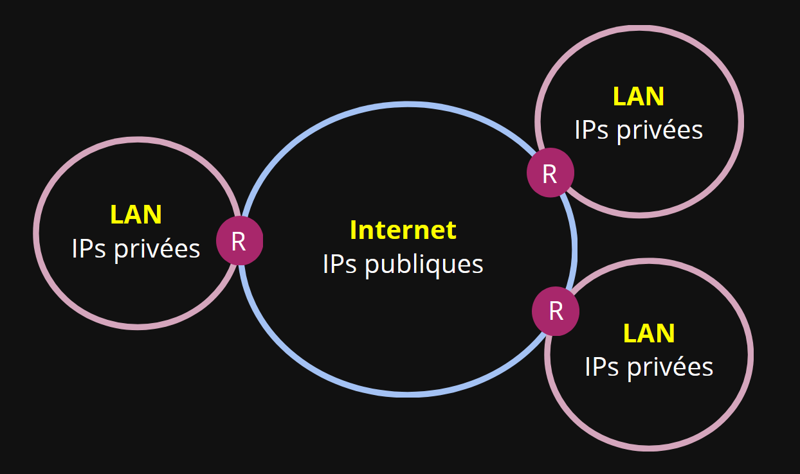

# Manipulation d'adresses IP

- [Manipulation d'adresses IP](#manipulation-dadresses-ip)
- [I. Adresse IP](#i-adresse-ip)
  - [1. Intro](#1-intro)
  - [2. Utilité](#2-utilité)
  - [3. Adresses privées et publiques](#3-adresses-privées-et-publiques)
    - [A. Adresses IP privées](#a-adresses-ip-privées)
    - [B. Adresses IP publiques](#b-adresses-ip-publiques)
- [II. Calcul d'adressage](#ii-calcul-dadressage)

# I. Adresse IP

## 1. Intro

> IP c'est pour *Internet Protocol*.

Une adresse IP se présente sous la forme `10.1.1.50` : c'est une suite de 4 octets, les valeurs allant donc de 0 à 255.

Elle est **toujours** accompagnée d'un **masque de sous-réseau** qui se présente sous une forme similaire à une adresse IP, par exemple `255.255.255.0` ou dans une notation qu'on appelle CIDR : `/24`.

> Si on convertit un masque de sous-réseau en binaire, il est **toujours** constitué d'une suite de 1, puis de 0.

Par exemple, `255.255.255.0` se convertit en `1111 1111.1111 1111.1111 1111.0000 0000`.

Le nombre de 1 dans le masque en binaire détermine la notation CIDR. Ici on a 24 bits à 1, on peut donc aussi dire que ce masque est un `/24`.

On peut à tout moment consulter l'adresse IP portée par une carte réseau depuis un terminal :

```powershell
# Pour un Windows
PS C:\Users\it4> ipconfig /all

Wireless LAN adapter Wi-Fi:

   Connection-specific DNS Suffix  . : home
   Description . . . . . . . . . . . : Intel(R) Wireless-AC 9560 160MHz
   Physical Address. . . . . . . . . : D4-6D-6D-00-15-3B
   DHCP Enabled. . . . . . . . . . . : Yes
   Autoconfiguration Enabled . . . . : Yes
  ⭐IPv4 Address. . . . . . . . . .  : 192.168.1.29  ⭐(Preferred)
  ⭐Subnet Mask . . . . . . . . . .  : 255.255.255.0 ⭐
   Lease Obtained. . . . . . . . . . : Monday, October 16, 2023 6:11:24 PM
   Lease Expires . . . . . . . . . . : Tuesday, October 17, 2023 6:11:25 PM
   Default Gateway . . . . . . . . . : 192.168.1.1
   DHCP Server . . . . . . . . . . . : 192.168.1.1
   DNS Servers . . . . . . . . . . . : 192.168.1.1
```

## 2. Utilité

Une adresse IP permet de :

- fabriquer des ***paquets IP*** à d'autres machines
- envoyer des trames Ethernet ne permet que de discuter avec des machines dans notre LAN
- **pour discuter avec des machines qui sont dans d'autres réseaux** (sur internet par exemple) **il faut** pouvoir fabriquer des *paquets IP*

> On verra plus en détail dans la suite du cours pourquoi c'est absolument nécessaire d'utiliser des *paquets IP*.

## 3. Adresses privées et publiques

Comme on l'a vu dans les slides du premier cours, le réseau mondial ressemble à ça :



> Dans la réalité il y a évidemment des milliers voire des millions de LAN, mais ça reste le même principe.

Tous les réseaux locaux du monde, les LAN, sont interconnectés entre eux grâce à un réseau plus grand qu'on appelle Internet.

> **Internet n'est pas un LAN.** On le qualifie plutôt de *WAN* pour *Wide Area Network*.

On distingue donc deux types de réseau :

- les LAN, dans lesquels on utilise des adresses IP privées
- Internet, dans lequel on utilise des adresses IP publiques

### A. Adresses IP privées

Il a été défini arbitrairement trois plages d'adresses IP qui sont considérées comme ***privées***. Par corrolaire, toutes les autres adresses IP sont des adresses IP publiques.

Je vous renvoie directement [vers la page Wikipédia](https://en.wikipedia.org/wiki/Private_network) à ce sujet pour les 3 plages, cette page est très chouette.

Si une machine est connectée à un LAN alors elle **doit** forcément avoir une adresse IP privée, c'est à dire qu'elle doit être à l'intérieur d'une des trois plages définies comme privées.

Les LANs qui ne sont pas directement connectés entre eux, mais uniquement connectés à Internet, peuvent avoir des adresses IP qui sont dupliquées ça ne pose aucun soucis.

> Ce serait comme avoir deux rues qui portent le même nom, mais dans des villes différentes : aucun soucis !

### B. Adresses IP publiques

➜ **Une machine qui est joignable sur Internet doit forcément avoir une adresse IP publique.** C'est une adresse qui est en dehors des 3 plages d'adresses privées.

**Il existe des registres publics d'adresse IP publics**, dont s'occupe des organismes comme le [RIPE](https://www.ripe.net/). Il faut les contacter pour pouvoir acheter ou louer une adresse IP publique. En effet, chaque IP publique est strictement unique au sein de tout Internet.

➜ **Un routeur qui permet un accès à Internet (comme une box à la maison) a au moins deux interfaces réseau** :

- une connectée au LAN
  - avec une adresse IP privée
  - cette interface est la passerelle de toutes les autres machines du LAN
- une connecté à Internet
  - avec une IP publique

> Tous les membres d'un LAN sont identifiés de la même façon quand ils vont sur internet : c'est l'adresse IP publique du routeur qui forme l'identité des requêtes. L'adresse IP privée d'une machine dans un LAN n'est jamais joignable depuis Internet. Il est donc rigoureusement impossible de joindre directement quelqu'un qui est dans un autre LAN.


# II. Calcul d'adressage

A partir d'une *adresse IP* et d'un *masque de sous-réseau*, on peut déduire :

- l'*adresse du réseau* dans lequel se trouve l'adresse IP donnée
- l'*adresse de broadcast* ("diffusion") de ce réseau LAN
- et enfin le nombre d'hôtes disponibles dans ce réseau LAN

---

A l'aide d'un `ipconfig` ou `ifconfig`, on peut **repérer l'adresse IP d'une machine donnée**.

Nous continuerons avec un exemple, en servant de l'IP privée suivante : `192.168.3.17/22`.  

**1.** `/22` est la *notation CIDR* d'une IP et de son masque. Une autre façon de le dire est :

- adresse IP : `192.168.3.17` ou en binaire `11000000.10101000.00000011.00010001`
- masque de sous-réseau : `255.255.252.0` ou en binaire `11111111.11111111.11111100.00000000`  
  
> Si on a un /22 alors on 22 bits à 1 au début du masque, puis le reste rempli de 0. Un masque est toujours une suite de 1 d'affilée, puis de 0 d'affilée.

**2.** Notons l'un sous l'autre afin de correctement visualiser l'utilisation du masque :

```bash
A. 11000000.10101000.00000011.00010001  (adresse IP)
B. 11111111.11111111.11111100.00000000  (masque de sous-réseau)
```  
  
**3.** Pour **calculer l'adresse de réseau**, il faut regarder les deux lignes en même temps (comme si on appliquait un "masque" à l'adresse IP, vraiment) :

- si la ligne B (le masque) contient un 1, alors on "garde" le chiffre correspondant de la ligne A
- si la ligne B (le masque) contient un 0, alors on "jette" le chiffre correspondant de la ligne A, et on note 0
  
- ici, on obtient :

```schema
                             adresse
        adresse réseau         hôte
   .----------------------..---------.
A. 11000000.10101000.00000011.00010001  (adresse IP)
B. 11111111.11111111.11111100.00000000  (masque de sous-réseau)
C. 11000000.10101000.00000000.00000000  (adresse de réseau)
```

> Une autre façon de le dire, c'est que si le masque c'est un /22, alors on va garder les 22 premiers bits de l'adresse de départ, et remplir le reste avec des 0.

**L'adresse de réseau de `192.168.1.37/22` est `11000000.10101000.00000000.00000000/22` soit `192.168.0.0/22`.**
Elle correspond dans notre exemple au 22 premiers bits de l'adresse IP de départ, suivie de 0. Car c'est un `/22`.  

**4.** Pour **calculer l'adresse de broadcast**, on garde aussi les 22 premiers bits de l'adresse IP, mais cette fois, on comble avec des 1 :

```schema
                             adresse
        adresse réseau         hôte
   .----------------------..---------.
A. 11000000.10101000.00000011.00010001  (adresse IP)
B. 11111111.11111111.11111100.00000000  (masque de sous-réseau)
C. 11000000.10101000.00000000.00000000  (adresse de réseau)
D. 11000000.10101000.00000011.11111111  (adresse de brodcast)
```

**L'adresse de broadcast du réseau `192.168.0.0/22` est `11000000.10101000.00000011.11111111/22` soit `192.168.3.255/22`.**  
Elle correspond dans notre exemple au 22 premiers bits de l'adresse IP de départ, suivie de 1. Car c'est un `/22`.  

> Une autre façon de le dire, c'est que si le masque c'est un /22, alors on va garder les 22 premiers bits de l'adresse de départ, et remplir le reste avec des 1.

**5.** Une fois ces notions en tête, on peut **calculer le nombre d'hôtes possibles** :

- notre réseau est un `/22` cela fait donc 10 bits disponibles pour nos adresses d'hôtes (l'IP est constituée de 32 bits, et 22 sont réservés à l'adresse réseau)
- 10 bits disponibles, cela fait 2^10 possibilités, soit 1024 possibilités, **1024 "adresses possibles MAIS"** :
  - l'adresse de réseau n'est pas utilisable : 1023 possibilités
  - l'adresse de brodcast n'est pas utilisable : 1022 possibilités
  - si le réseau possède une gateway, son IP n'est pas libre : 1021 possibilités
- en comptant l'adresse de gateway, on a **1021 adresses disponibles** ("possible" != "disponible")

---

- **On peut donc dire que :**
  - la partie `adresse de réseau` ne change **jamais** pour toutes les adresses d'un réseau LAN donné
  - toutes les machines d'un même réseau LAN peuvent communiquer si leurs adresses IP ont la même adresse de réseau
  - grâce à nos interfaces réseau, on peut porter des IPs, et ainsi être dans un réseau
  - **c'est bien le fait d'avoir une adresse IP qui nous rend "membre d'un réseau IP"**  
