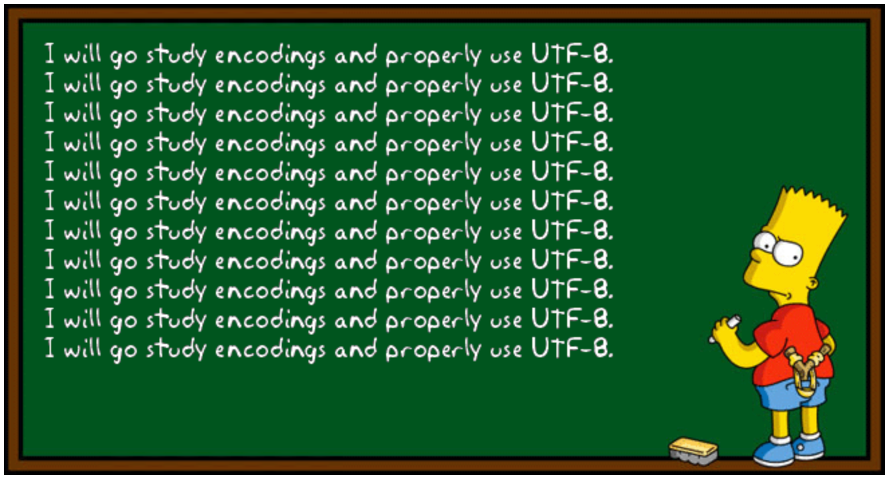
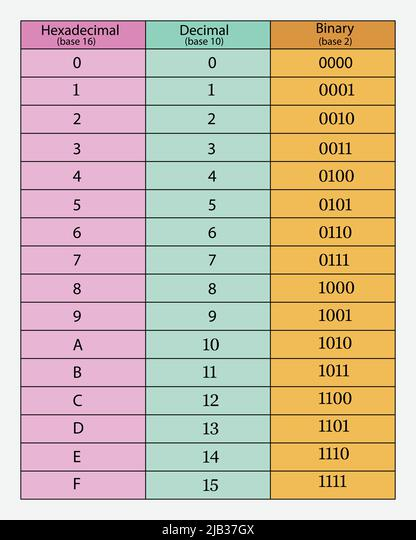

# Encodage

**Petite intro à l'encodage, et pourquoi ça vous concerne en tant que dév.**

Ca permet aussi de mieux comprendre comment on fait de l'opti réseau, indispensable pour des contextes comme les jeux en ligne, parmi des tonnes d'autres.

Donc essentiel pour votre culture de dév et ptet directement lié à ce que vous ferez plus tard.

➜ **Concrètement, dans ce cours, on va discuter de à quel point on peut maîtriser, au bit près, ce qu'on envoie sur le réseau quand un client et un serveur discute.**

## Sommaire

- [Encodage](#encodage)
  - [Sommaire](#sommaire)
  - [I. Intro encodage](#i-intro-encodage)
    - [1. Intro](#1-intro)
    - [2. Hexadécimal et décimal](#2-hexadécimal-et-décimal)
    - [3. ASCII et UTF-8](#3-ascii-et-utf-8)
  - [II. Optimisation encodage](#ii-optimisation-encodage)
    - [1. Exemple concret](#1-exemple-concret)
    - [2. Respectez les entiers ce sont des mecs cools](#2-respectez-les-entiers-ce-sont-des-mecs-cools)
    - [3. Pas que les nombres](#3-pas-que-les-nombres)

## I. Intro encodage

### 1. Intro

➜ Aujourd'hui, on a de belles applications, avec du texte dedans, des images, des boutons, de vidéos, des trucs de ouf quoi.

Pour parler encodage, faut se rappeler que tous ces machins, ce sont que des 0 et des 1 pour un PC.

➜ **Pour être plus précis, le binaire nous est rigoureusement imposé**, on a pas le choix, dès qu'on utilise un ordi. Parce que par exemple :

- le processeur résout des opérations booléennes : il prend des 0 et des 1 en entrée, et effectue un calcul
- la RAM stocke les données sous forme binaire
- un disque dur stocker les données sous forme binaire (des aimants)
- des données qui circulent sur le réseau sons sous forme binaire (courant alternatif)

**Le binaire nous est imposé par le matériel.**

➜ Pour stocker ou échanger des caractères comme des lettres on est donc obligés d'**associer à une séquence de bit donnée un caractère donné**

Par exemple, on **décide** arbitrairement que `01000001` correspondra à `A`.

➜ **On appelle une telle règle un encodage.**

### 2. Hexadécimal et décimal

➜ **On utilise le décimal parce que ça parle aux humains**

On utilise le système décimal tous les jours pour compter. Mais y'a pas trop d'intérêt pour une machine.

> Parce qu'on a 10 doigts probablement, c'est ce que pensent les historiens/sociologues. Si on avait eu que 2 doigts, on compterait probablement en binaire au quotidien n_n

➜ **Lire le binaire c'est chiant**, on voit pas facilement apparaître des données avec notre cerveau humain.

Un bon moyen de regarder des données brutes c'est l'hexa. C'est un multiple de 2, donc 4 bit tout pile c'est 1 caractère hexa. Autrement dit, une chaîne hexa est toujours 4x plus courte tout pile que la même chaîne représentée en binaire.  
**Le cerveau humain s'y fait bien, et c'est donc souvent la représentation choisie pour afficher des données binaires.**

> Pourquoi est-ce qu'on peut être amené à traiter des données binaires ? Genre si t'es pas un hacker qui y est confronté tout le temps ? Juste en tant que dév ? On voit ça dans la partie II.

P'tit tableau de correspondance binaire, décimal et héxadécimal :

### 3. ASCII et UTF-8

**ASCII et UTF-8** sont des encodages qui permettent d'encoder plus de caractères.

➜ **ASCII** se limite à 128 caractères (7 bits pour chaque caractère) dans sa version classique, et 256 (8 bits/char) dans sa version étendue.

➜ **UTF-8** est un *hack* d'une beauté sans nom, qui permet d'encoder autant de caractères qu'on veut, sans pour autant gaspiller beaucoup de ressources réseau.

Pour en savoir plus sur UTF-8, en vrai de vrai, c'est rare, mais [je vous renvoie vers l'excellente vidéo sur l'excellente chaîne Computerphile](https://www.youtube.com/watch?v=MijmeoH9LT4) *-deux fois excellent, mais c'est mérité-* (en plus ce gars a été meme 1000 fois c'marrant de le voir expliquer des trucs de ouf). C'est court, concis et clair.

## II. Optimisation encodage

Quand on est dév, on cherche à faire des apps qui fonctionnent. C'est déjà bien.

Une app qui fonctionne vite et qui est économe c'est clairement mieux.

On va donc voir dans cette partie en quoi s'intéresse à l'encodage amène à de l'optimisation. Aussi, pourquoi on trouve PARTOUT des exemples d'encodages faits maison (typiquement dans le milieu du MMORPG).

### 1. Exemple concret

> *On parle uniquement de Python ici. Chaque langage a ses règles à sur ce sujet.*

➜ **Imaginons un client qui envoie "10000" à un serveur sur le réseau :**

> Par exemple tu viens de filer 10000 pièces d'or à un pote sur j'sais pas quel jeu. On s'en fout du contexte, c'est indépendant du contexte comme raisonnement !

- Python utilise par défaut un encodage UTF-8
- ici ce sont des caractères simples, donc UTF-8 encode chaque caractère sur un octet
- "10000" est donc encodé sur 5 octets
- or, écrire 10000 en binaire, 2 octets ça suffit

➜ 💡 **On peut donc dire qu'on envoie inutilement 3 octets sur le réseau pour le nombre 10000**

---

➜ Là vous pouvez vous dire **"balec de ces 3 octets, c'est juste quand on envoie un pauvre nombre"**.

> *Genre pour faire une calculatrice nulle dans un TP réseau par exemple. Donc balec.*

Dans le monde réel, **ce genre d'optimisation est et doit être omniprésente.**  
Est-ce envisageable de perdre 3 octets à chaque fois qu'on envoie un entier si on considère, pour ne donner qu'un seul exemple, les jeux en ligne :

- un jeu avec des dégâts/soin etc, ce ne sont que des entiers qui circulent du client au serveur
  - le serveur calcule envoie le montant de dégâts au client, pour qu'il l'affiche
- un jeu avec des échanges/récompenses/gains
  - les gains de monnaie ce ne sont que des entiers
- des coordonnées ? Une quantité de munition ? Une quantité de potion ? Un craft réalisé ? DES NOMBRES
- puis bon, on ne gère les objets, les spells, les joueurs, etc. qu'avec leurs IDs
  - un ID... c'est un entier
  - dès qu'il y a une transaction dans une application numérique, c'est un objet qui a un ID unique qui change de propriétaire
  - cet ID il circule sur le réseau
  
Vous pouvez rapidement vous rendre compte que ça s'applique pas qu'aux jeux. Une quantité non négligeable des données qui circulent sont des nombres.

### 2. Respectez les entiers ce sont des mecs cools

➜ **Long story short : il faut traiter les entiers comme des entiers et pas comme des strings**

- plus l'entier est grand, plus c'est worth. (pour "10000" on économise déjà 3 octets)
- ça demande une gymnastique intellectuelle
- et des ajustements pour le dév
  - si j'envoie 1 seule octet quand j'envoie "200" et 2 octets quand j'envoie "1000" ça veut dire que la taille des messages va varier
  - on reçoit des valeurs sur 1 octet, parfois 2, parfois 36
- système de headers (en-tête)
  - le client annonce la taille des messages dans un en-tête (header) de taille fixe (4 octets par exemple)
  - sur le serveur, quand tu reçois un message du client, tu lis 4 octets (par exemple) et ils contiennent la taille du message qui suit
  - il te reste plus qu'à lire X octets : la taile que t'as lue dans l'en-tête
- **c'est relou mais le gain potentiel est énorme** : 2 octets au lieu de 5, on gagne 150% d'efficacité, rien quand dans ce tout petit contexte de calculette nulle

➜ **Dites vous que quand tu consommes une app en ligne** :

- ton processeur carbure, *ultra puissant le machine*
  - plusieurs milliards d'opérations par secondes
- il se traîne ta RAM, *qui rame mais ça va vite quand même*
- il se traîne ton disque, *ça rame un peu là quand même*
- il se trâine la connexion réseau, *euuuuh ça rame BEAUCOUP et c'est zéro fiable cette histoire*
  - à peine quelques Mb/sec
- **donc le réseau on le traite avec parcimonie, moins on le sollicite, mieux on se porte !**

TU VAS LES ECONOMISER CES 3 OCTETS JE TE LE DIS. 🌼

**Le réseau c'est lent et ça coûte si cher.**

### 3. Pas que les nombres

Là, l'exemple avec "10000" sur le réseau, c'est qu'un exemple. Il existe des tas de façons d'optimiser des échanges réseau.

Par exemple :

- **compresser** les données avant de les envoyer sur le réseau
  - le client et le serveur doivent compresser avant d'envoyer
  - décompresser à la réception
- utiliser un **encodage maison de A à Z avec des tailles dynamiques**
  - ainsi, on ne fait jamais circuler de bits inutiles sur le réseau
  - chaque bit est opti
- **limiter les échanges entre le client et le serveur**
  - plutôt qu'un client qui demande toutes les 5 secs des nouvelles data à un serveur (pull)
  - un serveur qui envoient des nouvelles données *quand elles sont dispos* au client (push)

De façon générale : on essaie d'envoyer le moins de données entre client et serveur, pour solliciter le réseau le moins possible.

> Quand on compresse/décompresse à chaque message reçu/envoyé par exemple, on demande bien + de travail à notre CPU et à notre RAM, mais on sollicite moins le réseau. On gagne donc en perfs dans la plupart des cas.
