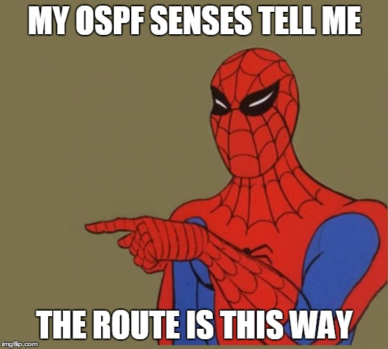
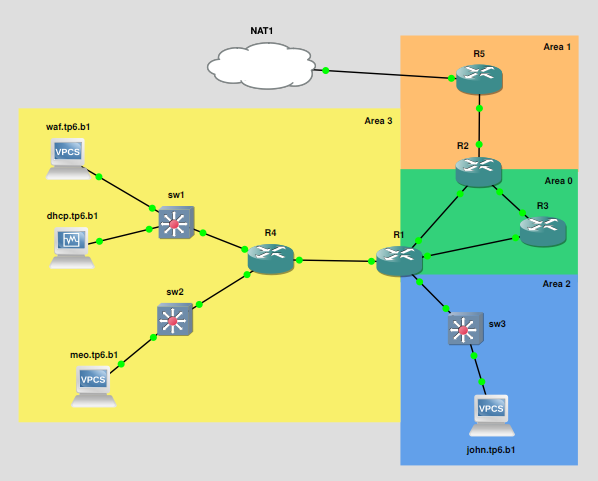

# OSPF : Open Shortest Path First

➜ **OSPF (pour *Open Shortest Path First*) est un protocole de routage dynamique qui est opensource**

Il est utilisé dans les infrastructures de grande taille, dotées de multiples routeurs, afin que ces derniers partagent dynamiquement leurs tables de routage.

Il n'est ainsi potentiellement plus du tout nécessaire d'ajouter des routes statiques sur nos routeurs afin que tous les réseaux soient joignables.

## Sommaire

- [OSPF : Open Shortest Path First](#ospf--open-shortest-path-first)
  - [Sommaire](#sommaire)
  - [I. Survol](#i-survol)
    - [1. Intro](#1-intro)
  - [II. Un peu plus en détail](#ii-un-peu-plus-en-détail)
    - [1. Aires OSPF](#1-aires-ospf)
    - [2. Rôles des routeurs](#2-rôles-des-routeurs)
      - [A. Le DR et le BDR](#a-le-dr-et-le-bdr)
      - [B. ABR](#b-abr)
    - [3. Trames OSPF](#3-trames-ospf)
    - [4. Caractère dynamique](#4-caractère-dynamique)

## I. Survol

### 1. Intro

➜ **Deux routeurs connectés et avec OSPF activé vont mutuellement s'informer des réseaux auxquels ils sont connectés**

Ils vont ensuite automatiquement modifier leurs tables de routage respectives afin d'inclure les nouveaux réseaux appris.

➜ **Une fois que tous les routeurs ont partagé leurs tables de routage ils vont calculer le chemin le plus court entre tous les réseaux**

Donc le partage de route est automatique, mais il va aussi être optimisé avec un algorithme qui calcule le chemin le plus court pour aller d'un réseau donné à un autre.

N'importe quel paquet qui doit être routé sera acheminé jusqu'au réseau de destination en utilisant le chemin le plus court pour y parvenir.

> *On revient sur ce que veut dire concrètement "le plus court" dans ce contexte plus bas dans le document. C'est l'intro là, calme-toi.*

➜ **Pour le mettre en place, il faut** :

- activer OSPF
  - c'est à dire lancer un processus OSPF
  - il va exécuter l'algo OSPF
  - entretenir une base de données OSPF (les réseaux connus, les routeurs voisins, etc)
- indiquer quels réseaux partager avec les autres routeurs OSPF
  - une commande pour chaque réseau à partager

➜ **Il existe d'autres protocoles de routage dynamiques**

Celui-ci, étant opensource et notoirement efficace, il est utilisé un peu partout et compatible avec pas mal de trucs (tout ?).

On peut citer EIGRP, très connu, protocole propriétaire Cisco qui fait aussi du routage dynamique.

## II. Un peu plus en détail

### 1. Aires OSPF

➜ **Si l'on souhaite activer OSPF au sein d'une architecture réseau, il sera nécessaire de mettre en oeuvre le concept d'aires OSPF**

Ainsi, on devra spécifier sur chaque interface de chaque routeur à quel aire OSPF elle appartient.

Ceci permet de limiter grandement le flood de trames OSPF. En effet, un routeur donné ne partagent des infos qu'avec les routeurs de son aire.

➜ **L'aire 0 a un rôle particulier, on l'appelle aire backbone**

L'aire de backbone a pour rôle de connecter entre elles toutes les autres aires.

➜ Exemple de topo OSPF (un peu nul) tiré du TP6 :

- les aires sont les rectangles de couleur
- l'aire 0 de backbone est connectée à toutes les autres

### 2. Rôles des routeurs

#### A. Le DR et le BDR

➜ **Au sein de chaque aire existe un DR pour *Designated Router* et un BDR pour *backup Designated Router*.**

Là encore, l'idée principale, c'est de limiter le *flood* intempestif.

➜ En effet, **les trames OSPF ne sont pas envoyées à tous les routeurs d'une aire mais uniquement au DR**

Le DR redistribue alors l'info à tous les autres routeurs du réseau. Ca évite le flood et ça évite que des routeurs reçoivent deux fois (ou mille fois) la même info.

➜ .**Le BDR a juste pour rôle de prendre le rôle de DR si celui-ci vient à crever**

➜ **Il y a une élection automatique** parmi les routeurs pour choisir qui est DR et qui est BDR

Celui qui a le router-id le plus bas est élu DR, BDR pour le deuxième. C'est un critère arbitraire nul : on s'en fout de qui c'est, ce qui compte c'est qu'il y en ait un.

Et ce critère nul permet à un admin d'influer facilement dessus pour choisir quel routeur sera DR et/ou BDR au sein d'une aire.

> Il y a de nouveau une élection (pour un nouveau DR et/ou BDR) avec des échanges de trames OSPF entre tous les routeurs d'une aire si le DR ou le BDR crève à un moment donné.

#### B. ABR

➜ **Un routeur a le rôle d'ABR s'il est connecté à la fois à l'area 0 (la backbone) et une autre zone.**

C'est lui qui agit comme une passerelle entre les deux aires, il a donc pour tâche de partager les routes dispos dans une aire vers l'autre.

➜ **Dans le schéma du TP6 au dessus, R1 est un ABR** car il connecte l'aire 3 à l'aire de backbone (aire 0).

C'est donc R1 qui est chargé de partager les routes connues au sein de l'aire 3 vers le DR de l'aire 0. Ainsi les routeurs de l'aire 0 apprendront l'existence des réseaux IP situés dans l'aire 3.

Et vice-versa, R1 a pour rôle d'informer les routeurs de l'aire 3 des réseaux IP joignables de la backboone.

➜ **Bref, un ABR c'est genre un pivot entre deux aires, c'est lui qui propage les infos d'une aire à une autre**

C'est clairement le terme qu'on utilise : propagation de routes.

> P'tit bonus : le temps que toutes les routes se propagent partout, on appelle ça **le temps de convergence**. Genre le temps que tous tes routeurs discutent et apprennent toutes les routes accessibles.

### 3. Trames OSPF

On a pas détaillé en cours la gueule des trames OSPF, je ne vais donc pas non plus le faire ici.

Quelques lignes sur le sujet malgré tout :

- *LSA (link state advertisement)*
  - un message qui contient toutes les routes auxquelles a accès un routeur donné
- *LSU (link state update)*
  - une trame qui contient un ou plusieurs LSA
  - spammée par les routeurs pour informer les voisins
- *DBD (database description)*
  - un message qui informe que le routeur est connecté à un autre routeur
  - envoyé quand un routeur découvre ses voisins OSPF, tout au début des échanges

### 4. Caractère dynamique

➜ **Non seulement OSPF permet aux routeurs de partager leurs routes, mais c'est aussi un protocole qui réagit dynamiquement aux changements de topologie**

En effet, le rôle d'OSPF est de choisir le chemin le plus court quand un paquet doit être acheminé d'un réseau à un autre.

Ainsi, chaque routeur associe à chaque connexion vers un routeur (à chaque lien) un coût.

> Il existe une valeur par défaut pour le coût, qu'on peut modifier manuellement pour chaque interface de chaque routeur.

➜ **Chaque routeur stocke en permanence une base de données** qui représente l'état en temps réel du réseau et de l'état des liens ainsi que leur coût.

OSPF calcule depuis tous les routeurs le chemin le plus court pour joindre chacun des réseaux partagés au sein de la topologie. Si un paquet doit être routé vers un réseau, il prendra donc le chemin le plus court, en fonction du coût de chaque lien.

➜ **On dit qu'il est dynamique** car si un routeur ou un lien meurt, les processus OSPF qui s'exécutent sur tous les routeurs vont échanger des messages (LSU) pour indiquer à tout le monde que la topologie doit changer.

Les coûts sont recalculés, afin que les paquets soient toujours acheminés sur le chemin le plus court.

**C'est automatique et spontané en fonction des changeemnts de topologie : on dit donc que c'est dynamique.**

