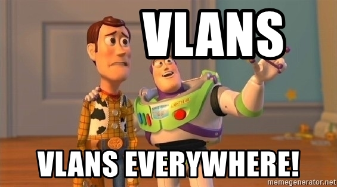
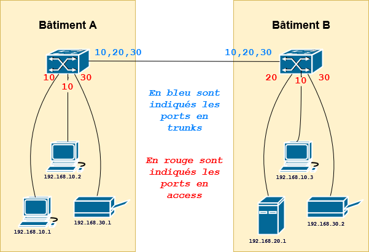
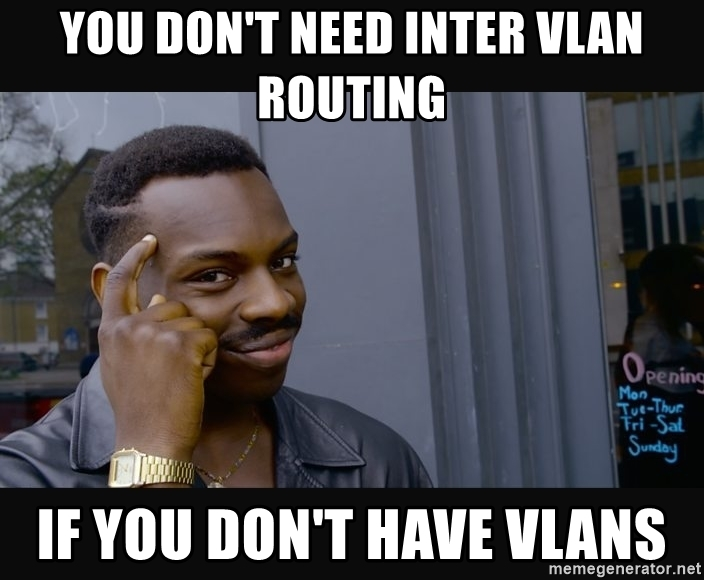
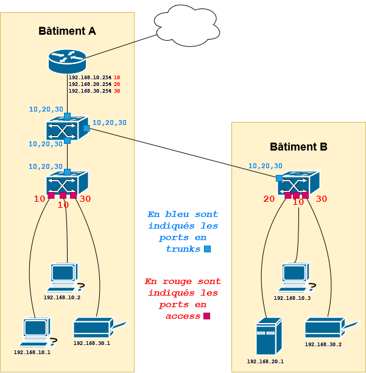

# VLAN

- [VLAN](#vlan)
- [I. VLAN](#i-vlan)
  - [1. Mise en place des VLANs](#1-mise-en-place-des-vlans)
  - [2. Comment fonctionnent les VLANs](#2-comment-fonctionnent-les-vlans)
  - [3. Pourquoi on se sert des VLANs](#3-pourquoi-on-se-sert-des-vlans)
- [II. Le routage inter-VLAN](#ii-le-routage-inter-vlan)
  - [1. Intro routage inter-VLAN](#1-intro-routage-inter-vlan)
  - [2. Le principe du routage inter-VLAN](#2-le-principe-du-routage-inter-vlan)
  - [3. Exemple](#3-exemple)

**Les VLANs permettent de mettre en place de l'isolation réseau, de maîtriser le flux de trames qui circulent.**

On va pouvoir empêcher des clients du réseau de se joindre, et autoriser d'autres clients à se joindre. Un premier pas vers la maîtrise des flux réseau dans une infra !

**La mise en place des VLANs au sein d'un réseau c'est la première étape, étape élémentaire, pour avoir un réseau sécurisé et maîtrisé.**

# I. VLAN

## 1. Mise en place des VLANs

**La configuration des VLANs ne s'effectuent QUE sur des *switches*** (pas sur les clients, ni les routeurs, mais rien d'autres enfet. Uniquement les *switches*).

> Une fois qu'on a commencé à configurer les VLANs au sein d'une infrastructure, TOUS les *switches* doivent posséder une configuration VLANs, sinon toute communication sera impossible.

Il existe deux types de ports sur un *switch*, suivant comment il sera utilisé :

- **quand le port sera utilisé par un client**
  - cela permet au client de se brancher au réseau
  - par câble ou WiFi
  - **on définit sur ce port un unique VLAN** : le VLAN dans lequel on veut que le client se trouve
  - chez Cisco, on parle de ***port access***
- **quand le port sera utilisé par un autre équipement réseau**
  - pour relier deux *switches* entre eux par exemple
  - pour relier un *switch* et un routeur
  - **on peut autoriser plusieurs VLANs à circuler sur ce genre de ports**
  - chez Cisco, on parle de ***port trunk***

## 2. Comment fonctionnent les VLANs

Une fois qu'on a défini un VLAN sur le port d'un *switch*, le *switch* va devenir actif lorsqu'une trame arrive jusqu'à lui, et ne plus agir comme une simple multiprise passive.

A chaque trame d'un client que le *switch* reçoit, **il la reçoit désormais à travers un port qui est marqué comme appartenant à un VLAN donné**. 

**Il va alors *tag* la trame.** : le *switch* va marquer dans chaque trame le VLAN dont elle provient.

> S'il reçoit une trame d'un client qui est branché sur un port attribué au VLAN `20`, il va littéralement modifier la trame pour écrire le numéro du VLAN à l'intérieur, pour écrire `20` en l'occurence.

Le *switch* va ensuite envoyer la trame vers sa destination. Deux cas de figures :

➜ **la trame est à destination d'une autre machine qui est aussi branchée au switch**

- cette autre machine est un autre client du réseau
- ce client est branché sur un port du même switch, sur un port access donc
- le switch va autoriser la trame à passer si les deux ports sont marqués comme étant dans le même VLAN
- sinon il va drop la trame

➜ **la trame est à destination d'une autre machine qui n'est PAS branchée au switch**

- cette autre machine est un autre client du réseau, mais il est connecté à un autre switch du réseau
- la trame doit donc être envoyée vers cet autre switch, peu importe où il est exactement, la trame va sortir vers un autre équipement réseau
- la trame va donc sortir vers un port trunk
- ce trunk autorise uniquement certains VLANs à circuler
- soit le VLAN est autorisé, soit il est jeté
- le prochain switch pourra autoriser ou jeter la trame à son tour, car c'est marqué dans la trame
  - ça a été marqué par le premier switch

➜ **dans les deux cas, une fois que la trame sort d'un switch vers le client final, ce dernier switch enlève le tag**

- donc le client d'origine n'a jamais su que son message a été taggé
- et le client final n'a jamais su non plus
- tout s'est passé entre les switches du réseau

## 3. Pourquoi on se sert des VLANs

Comme on l'a vu plus haut on se sert des VLANs pour isoler des machines du réseau. Si t'es pas dans le même VLAN qu'une autre machine, les switches t'empêcheront de la joindre.

Généralement dans la vie réelle :

- on attribue un sous-réseau IP par type d'équipement
- on associe à chaque sous-réseau un VLAN

Un exemple fictif :

| Machines               | Réseau          | VLAN |
|------------------------|-----------------|------|
| Clients bâtiment A     | `192.168.10/24` | `10` |
| Clients bâtiment B     | `192.168.10/24` | `10` |
| Serveurs bâtiment B    | `192.168.20/24` | `20` |
| Imprimantes bâtiment A | `192.168.30/24` | `30` |
| Imprimantes bâtiment B | `192.168.30/24` | `30` |

> On peut parfaitement mettre dans le même réseau et même VLAN des équipements qui sont géographiquement dans des endroits différents, du moment qu'ils sont reliés par des câbles et des équipements réseau.

**Sauf que si on fait ça, bah oui, les clients peuvent plus joindre les imprimantes, chiant.** Routage inter-VLAN à la rescousse.

# II. Le routage inter-VLAN

## 1. Intro routage inter-VLAN

Tous les clients du réseau (les clients finaux, les serveurs, les imprimantes) sont isolés.

**Pas dans le même réseau IP déjà, mais surtout, les switches empêchent complètement les trames taggées de changer de VLAN.**

Si on ajoute un routeur à la topologie, il pourra faire deux choses :

- permettre un accès au WAN, à internet
- permettre aux clients de différents de VLANs de se joindre, en passant par lui
  - bah oui, les clients et les imprimantes sont dans des réseaux différents, et c'est son job au routeur : permettre aux paquets de changer de réseau
  - il peut aussi permettre à des trames taggées d'un VLAN d'accéder à un autre VLAN

> L'idée c'est que le routeur va devenir le chef d'orchestre est c'est lui qui décide qui a le droit de joindre qui. Enfin, c'est la conf qu'on fait qui lui permet de décider :)

## 2. Le principe du routage inter-VLAN

**Lorsque le routeur reçoit une trame, elle est taggée VLAN** : un switch l'a forcément fait.

> En effet, un switch l'a forcément fait car tous les clients du réseau sont branchés sur un port taggé. Comme dit plus tôt, les VLANs sont configurés sur TOUS les switches.

**L'admin a indiqué, pour chaque IP du routeur, dans quel VLAN cette IP se trouvait.** Ainsi, il reçoit une trame sur une de ses IPs, et il va autoriser ou non ce traffic.

> D'une certaine façon, le routeur est dans tous les VLANs à la fois.

Si la trame est acceptée, il va ensuite devoir la renvoyer vers le client de destination.

Il va alors regarder par quelle interface cette trame doit sortir. Cette interface est taggée avec un numéro de VLAN.

**Le routeur va alors enlever le tag initial et mettre le nouveau tag VLAN pour autoriser la trame à circuler sur le réseau.**

Ainsi, des clients qui se trouvent dans des réseaux différents, et donc dans des VLANs différents, pourront communiquer.

> En plus d'être dans tous les VLANs à la fois, ça lui donne le pouvoir de permettre à des trames de changer de VLANs, en plus de changer de réseau (pour rappel, faire changer les trames de réseau c'est son boulot en tant que routeur).

**L'intérêt est de maîtriser les flux réseau. Les switches donnent un accès réseau au client. Le routeur centralise les flux, et les gère.**

## 3. Exemple

Dans l'exemple, on a ajouté, par rapport à l'exemple précédent :

- un routeur
  - accès internet
  - routage inter-VLAN
- un switch
  - tous les autres sont branchés sur lui
  - c'est ainsi facile de rajouter un éventuel nouveau switch pour une nouvelle pièce ou un nouveau bâtiment

**Si aucune restriction particulière est mise en place, toutes les machines peuvent se joindre dans cette topologie**, bien qu'elles soient dans des VLANs différents.

> Comme vu plus haut, pour que deux machines de VLANs différents communiquent, la trame doit remonter jusqu'au routeur, et c'est lui qui se chargera d'envoyer la trame dans vers sa destination, une fois qu'il aura mis un nouveau tag VLAN dans la trame.

